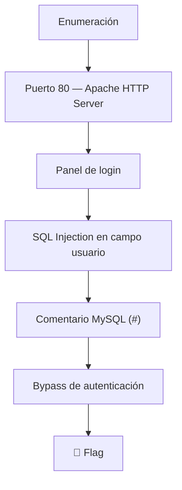
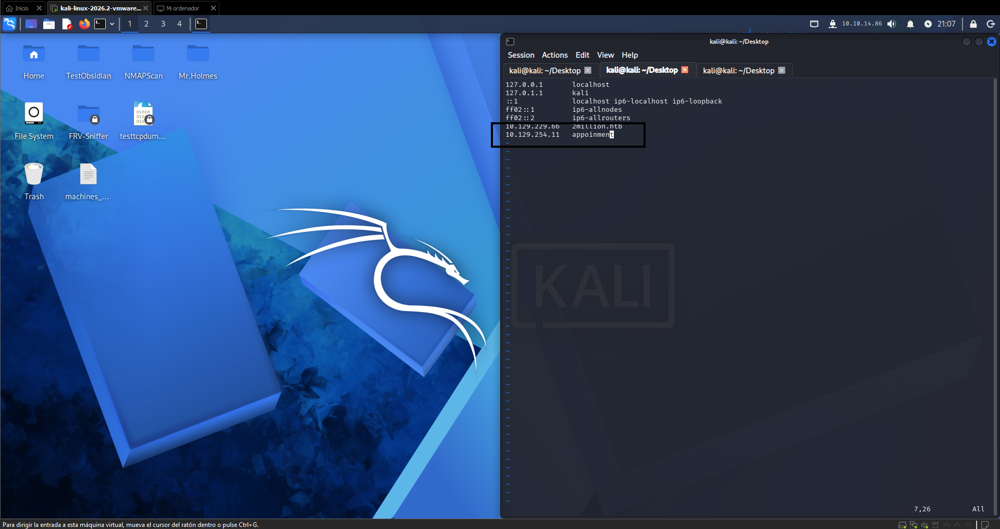
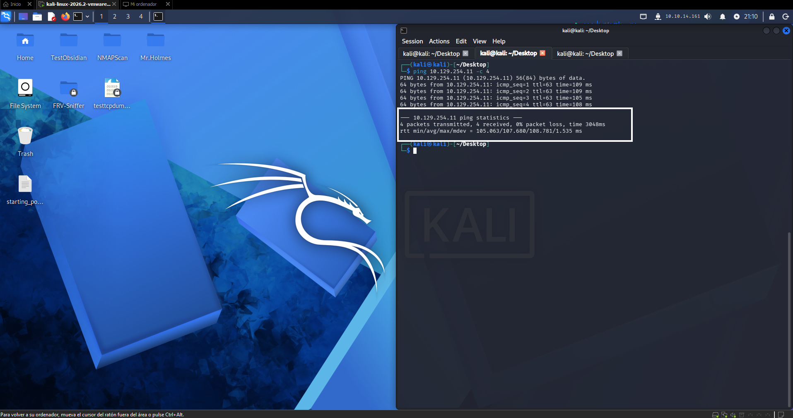
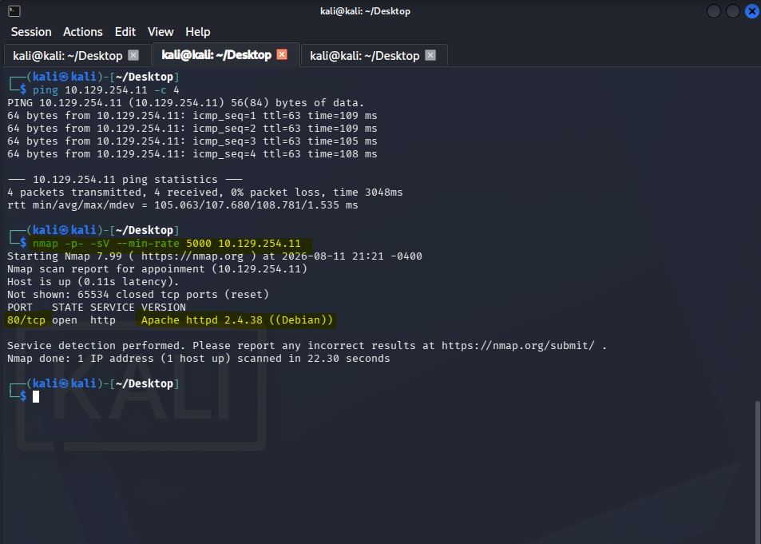
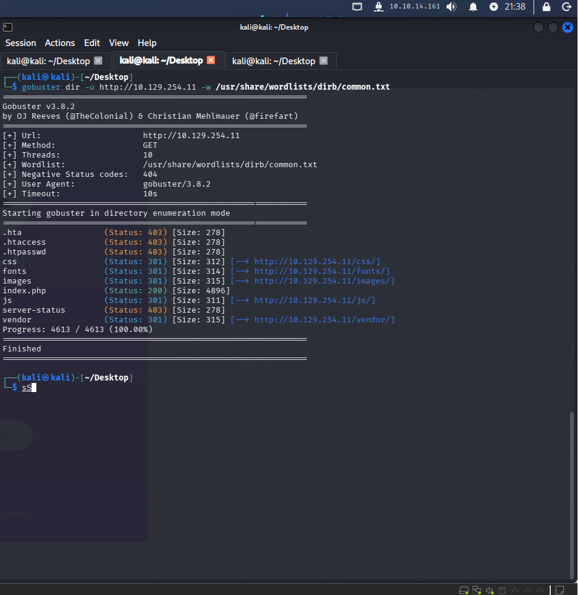
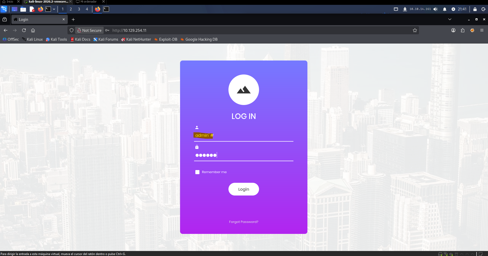
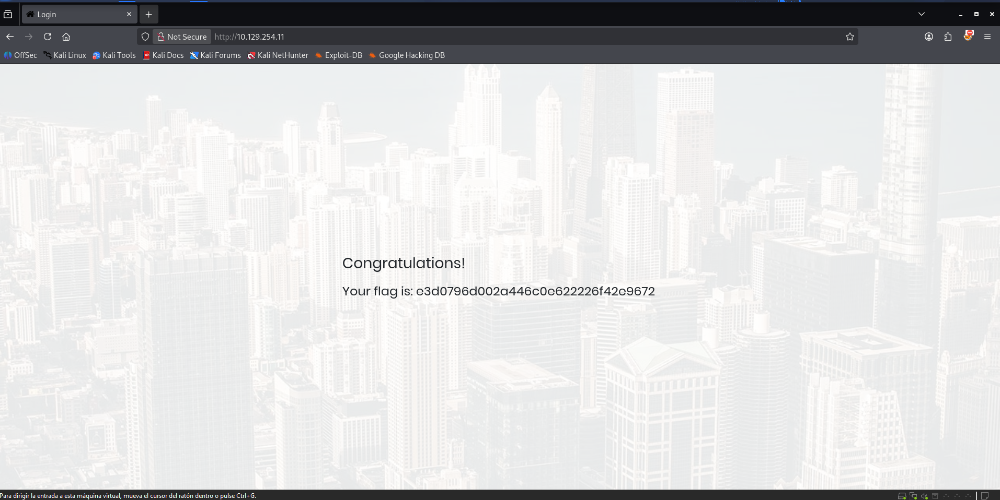

> [!info] Información de la máquina **Plataforma:** Hack The Box **Máquina:** Appointment **OS:** Linux **Dificultad:** Very Easy **IP objetivo:** `10.129.254.11` **IP atacante:** `10.10.14.161`

---

## 1. Resumen

**Appointment** es una máquina Linux de dificultad muy fácil orientada a la comprensión de **SQL Injection (SQLi)**. La aplicación web expone un panel de login clásico que no sanitiza la entrada del usuario, permitiendo omitir la autenticación inyectando un comentario MySQL directamente en el campo de usuario.



> [!important] Idea clave La vulnerabilidad no requiere extraer datos de la base de datos ni explotar un backend complejo. Basta con inyectar `admin'#` en el campo de usuario para que MySQL ignore la comprobación de contraseña y autentique directamente.

---

## 2. Enumeración inicial

### 2.1 Comprobar conectividad

Antes de atacar, se verifica que la máquina está activa y mide latencia/estabilidad:

```bash
ping 10.129.254.11 -c 4
```

**Resultado:** `0% packet loss` → la máquina está activa y responde.



### 2.2 Añadir la máquina a `/etc/hosts`

```bash
sudo vim /etc/hosts
```

```text
10.129.254.11    appointment
```



### 2.3 Escaneo de puertos

```bash
nmap -p- -sV --min-rate 5000 10.129.254.11
```

| Flag | Propósito |
|---|---|
| `-p-` | Escanea los **65 535 puertos** TCP, no solo los 1 000 más comunes |
| `-sV` | Detección de versiones — identifica el servicio exacto y su versión |
| `--min-rate 5000` | Fuerza un mínimo de **5 000 paquetes/segundo** para acelerar el escaneo |



**Resultado relevante:**

```text
PORT   STATE SERVICE VERSION
80/tcp open  http    Apache httpd 2.4.38 ((Debian))
```

> Solo el **puerto 80** está abierto. La superficie de ataque es únicamente la aplicación web.

---

## 3. Reconocimiento web

Al visitar `http://10.129.254.11` se muestra un formulario de login estándar. No hay registro de usuarios ni funcionalidad adicional visible.

### 3.1 Enumeración de directorios con Gobuster

```bash
gobuster dir -u http://10.129.254.11 -w /usr/share/wordlists/dirb/common.txt
```



> [!tip] El switch `dir` en Gobuster indica búsqueda de **directorios**, no de subdominios (que sería `dns`). En terminología de aplicaciones web, una carpeta o directorio equivale a lo que Gobuster llama un *directory*.

---

## 4. Análisis de vulnerabilidades — SQL Injection

### 4.1 ¿Qué es SQL?

**SQL** (Structured Query Language) es el lenguaje estándar para la gestión e interacción con bases de datos relacionales.

### 4.2 ¿Qué es SQL Injection?

**SQL Injection (SQLi)** es la vulnerabilidad más común de tipo inyección. Ocurre cuando la entrada del usuario se incorpora directamente en una consulta SQL sin sanitización, permitiendo al atacante manipular la lógica de la consulta.

Clasificación OWASP:

| Campo | Detalle |
|---|---|
| **Categoría** | A03:2021 — Injection |
| **Posición anterior** | A01 en OWASP Top 10 2017 |
| **Alcance** | SQLi, OS command injection, NoSQL injection, LDAP injection |
| **Mitigación principal** | Consultas preparadas (parámetros vinculados) + validación estricta de entradas |

### 4.3 El carácter de comentario en MySQL

En MySQL, el carácter **`#`** comenta todo lo que venga a continuación en la misma línea. Esto permite truncar una consulta SQL en el punto deseado.

**Ejemplo de consulta vulnerable:**

```sql
SELECT * FROM users WHERE username='INPUT' AND password='INPUT2';
```

Si se introduce `admin'#` como usuario, la consulta resultante es:

```sql
SELECT * FROM users WHERE username='admin'# AND password='...';
```

Todo lo que va después de `#` queda comentado → la verificación de contraseña **desaparece**.

---

## 5. Explotación — Bypass de autenticación

### 5.1 Payload

```text
Usuario:    admin'#
Contraseña: (cualquier valor o vacío)
```

La consulta SQL que ejecuta el servidor:

```sql
-- Consulta original
SELECT * FROM users WHERE username='admin'# AND password='anything';

-- MySQL lo interpreta como:
SELECT * FROM users WHERE username='admin'
-- El AND password ya no existe → login exitoso si el usuario 'admin' existe
```

> [!success] Bypass de autenticación El servidor devuelve sesión válida como `admin` sin necesidad de conocer la contraseña.




---

## 6. Captura de flag

Tras el bypass de autenticación exitoso, la primera palabra visible en la página devuelta es la **flag**. ✅

---

## 7. Preguntas del módulo — Respuestas

| Pregunta | Respuesta |
|---|---|
| What does the acronym SQL stand for? | **Structured Query Language** |
| What is one of the most common type of SQL vulnerabilities? | **SQL Injection (SQLi)** |
| What is the 2021 OWASP Top 10 classification for this vulnerability? | **A03:2021 — Injection** |
| What does Nmap report as the service running on port 80? | **Apache httpd 2.4.38** |
| What is the standard port used for the HTTPS protocol? | **443** |
| What is a folder called in web-application terminology? | **Directory** |
| What switch does Gobuster use to discover directories? | **`dir`** |
| What single character can be used to comment out the rest of a line in MySQL? | **`#`** |
| What is the first word on the webpage returned after logging in as admin? | **congratulations** |

---

## 8. Cadena completa de ataque

```text
Enumeración (Nmap)
        ↓
Puerto 80 — Apache HTTP
        ↓
Panel de login
        ↓
SQL Injection: admin'#
        ↓
Comentario MySQL trunca la query
        ↓
Bypass de autenticación
        ↓
🏁 Flag
```

---

## 9. Conceptos aprendidos

- **SQL / SQLi:** el lenguaje de bases de datos relacionales y cómo su mal uso abre puertas de entrada sin credenciales.
- **Comentarios MySQL:** `#` comenta el resto de la línea; permite truncar consultas y eliminar condiciones críticas como la validación de contraseña.
- **OWASP A03:2021 — Injection:** categoría que engloba SQLi, OS injection, NoSQL y LDAP; históricamente el riesgo más crítico en aplicaciones web.
- **Gobuster `dir`:** herramienta de fuzzing de directorios web; el switch `dir` diferencia búsqueda de rutas de la búsqueda de subdominios (`dns`).
- **HTTPS puerto 443:** el protocolo seguro de transferencia web usa el puerto estándar 443.

---

## 10. Lecciones de pentesting

> [!important] Lección 1 — Nunca confiar en la entrada del usuario Cualquier campo de texto que interactúe con una base de datos debe usar consultas preparadas. Sin ellas, un solo carácter (`'`) puede comprometer toda la aplicación.

> [!important] Lección 2 — La enumeración guía el ataque Antes de lanzar exploits, Nmap confirma qué servicios existen. En esta máquina solo hay puerto 80 → el foco es 100 % web.

> [!important] Lección 3 — Un comentario puede ser una vulnerabilidad crítica `#` en MySQL no es solo sintaxis: en manos de un atacante que puede inyectarlo, es suficiente para eliminar la autenticación entera de un sistema.

---

## 11. Remediación

- **Consultas preparadas (prepared statements):** nunca concatenar entrada del usuario directamente en una query SQL.
- **ORM / Query builders:** usar capas de abstracción que paramétricen automáticamente las consultas.
- **Validación de entradas:** rechazar o escapar caracteres especiales como `'`, `"`, `#`, `--` en campos de formulario.
- **Principio de mínimo privilegio:** el usuario de base de datos de la aplicación no debe tener permisos de `DROP`, `ALTER` ni `CREATE`.
- **WAF:** un Web Application Firewall puede bloquear patrones de SQLi conocidos como capa adicional de defensa.

---

## 12. Resumen final

```text
1. Verificar conectividad (ping)
2. Escanear puertos (nmap -p- -sV)
3. Identificar servicio web en puerto 80
4. Enumerar directorios (gobuster dir)
5. Identificar panel de login vulnerable
6. Inyectar admin'# para truncar la query SQL
7. Obtener sesión autenticada como admin
8. Capturar flag
```

> [!success] Resultado **Flag:** capturada ✅ **Vector:** SQL Injection — bypass de autenticación con comentario MySQL (`#`) **Servicio crítico:** Apache HTTP en puerto 80 **Remediación clave:** consultas preparadas

