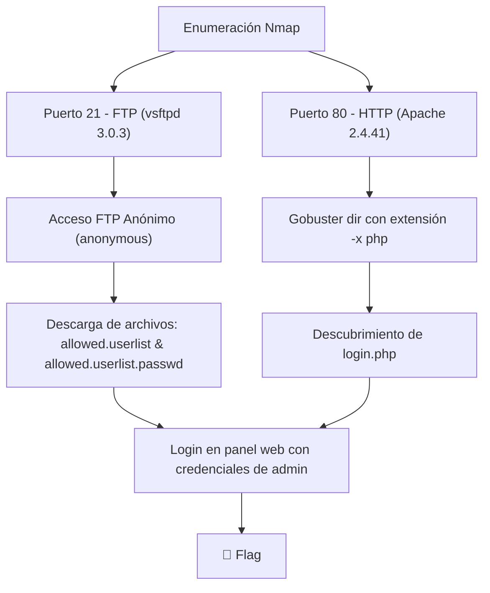

> [!info] Información de la máquina **Plataforma:** Hack The Box **Máquina:** Crocodile **OS:** Linux **Dificultad:** Very Easy **IP objetivo:** `10.129.175.149` **Dominio:** N/A **IP atacante:** `10.10.15.82`

---

## 1. Resumen

**Crocodile** es una máquina Linux de dificultad Very Easy perteneciente al itinerario Starting Point de Hack The Box. El objetivo principal es comprender la enumeración de servicios expuestos como **FTP** y **HTTP**, el acceso anónimo a FTP para la extracción de información sensible (listas de usuarios y contraseñas), el uso de **Gobuster** con extensiones de archivo específicas (`-x php`), y la autenticación en un panel web para obtener la flag.



> [!important] Idea clave
> El servidor FTP permite acceso anónimo (`anonymous`), exponiendo archivos de configuración con listas de usuarios y contraseñas. Reutilizando las credenciales de `admin` encontradas en el panel de administración web (`login.php`), se obtiene acceso directo a la flag.

---

## 2. Enumeración inicial

### 2.1 Escaneo de puertos con Nmap

Realizamos el escaneo de puertos en el objetivo `10.129.175.149` utilizando scripts predeterminados (`-sC`) y detección de versiones (`-sV`):

```bash
sudo nmap -sC -sV 10.129.175.149
```

| Flag | Propósito |
|---|---|
| `sudo` | Ejecuta Nmap con privilegios elevados para escaneos de paquetes SYN |
| `-sC` | Ejecuta los scripts predeterminados de NSE (Nmap Scripting Engine) |
| `-sV` | Determina la versión del servicio que se ejecuta en los puertos abiertos |


**Servicios identificados:**
- **Puerto 21/tcp:** FTP (`vsftpd 3.0.3`) - *Anonymous FTP login allowed (Code 230)*
- **Puerto 80/tcp:** HTTP (`Apache httpd 2.4.41`)

---

## 3. Enumeración y Explotación FTP

### 3.1 Conexión FTP Anónima

El escaneo Nmap indicó que se permite el inicio de sesión anónimo (`230 Login successful`). Nos conectamos al servidor FTP:

```bash
ftp 10.129.175.149
```

* **Usuario:** `anonymous`
* **Contraseña:** (presionar Enter o dejar en blanco)


### 3.2 Descarga de Archivos Sensibles

Una vez dentro de la sesión FTP, listamos el contenido del directorio con `ls` y descargamos los archivos de texto identificados usando el comando `get`:

```ftp
ftp> ls
ftp> get allowed.userlist
ftp> get allowed.userlist.passwd
```


Inspeccionando los archivos descargados:
- `allowed.userlist`: Contiene nombres de usuarios del sistema, destacando el usuario con mayores privilegios **`admin`**.
- `allowed.userlist.passwd`: Contiene las contraseñas asociadas.


---

## 4. Reconocimiento Web & Fuzzing con Gobuster

### 4.1 Fuzzing de directorios y extensiones PHP

Sabemos que en el puerto 80 corre un servidor web Apache (`Apache httpd 2.4.41`). Para encontrar paneles de administración u hojas de Login web, ejecutamos **Gobuster** especificando la extensión `-x php` para buscar archivos PHP concretos:

```bash
gobuster dir -u http://10.129.175.149/ -w /usr/share/wordlists/dirb/common.txt -x php
```

| Flag | Propósito |
|---|---|
| `dir` | Modo de búsqueda de directorios y archivos web |
| `-u` | URL del objetivo |
| `-w` | Wordlist para el ataque de fuerza bruta |
| `-x php` | Busca archivos con la extensión especificada (`.php`) |


Gobuster reporta el hallazgo del archivo **`login.php`**.

---

## 5. Acceso Web & Captura de Flag

Navegamos hacia `http://10.129.175.149/login.php` e ingresamos las credenciales obtenidas del servidor FTP para el usuario `admin`.


> [!success] Autenticación Exitosa & Flag Capturada
> Al iniciar sesión en `login.php` con el usuario `admin` y su respectiva contraseña, accedemos al panel de administración y obtenemos la **flag** del sistema. ✅

---

## 6. Preguntas del módulo — Respuestas

| Pregunta | Respuesta |
|---|---|
| ¿Qué opción de escaneo de Nmap utiliza scripts predeterminados durante un escaneo? | **`-sC`** |
| ¿Qué versión del servicio se ha detectado que se está ejecutando en el puerto 21? | **`vsftpd 3.0.3`** |
| ¿Qué código FTP se nos devuelve con el mensaje «Se permite el inicio de sesión FTP anónimo»? | **`230`** (o `230 Login successful`) |
| Una vez conectado al servidor FTP mediante el cliente FTP, ¿qué nombre de usuario debemos introducir cuando se nos pide que iniciemos sesión de forma anónima? | **`anonymous`** |
| Una vez conectados al servidor FTP de forma anónima, ¿qué comando podemos utilizar para descargar los archivos que encontremos en el servidor FTP? | **`get`** |
| ¿Cuál es uno de los nombres de usuario que parecen tener mayores privilegios en el archivo «allowed.userlist» que descargamos del servidor FTP? | **`admin`** |
| ¿Qué versión del servidor HTTP Apache se está ejecutando en el host de destino? | **`Apache httpd 2.4.41`** |
| ¿Qué opción podemos utilizar con Gobuster para indicar que buscamos tipos de archivo concretos? | **`-x`** |
| ¿Qué archivo PHP podemos identificar mediante un ataque de fuerza bruta en el directorio que nos permita autenticarnos en el servicio web? | **`login.php`** |

---

## 7. Cadena completa de ataque

```text
Escaneo de puertos Nmap (-sC -sV)
        ↓
Puertos abiertos: 21 (FTP vsftpd 3.0.3) y 80 (HTTP Apache 2.4.41)
        ↓
Conexión FTP anónima (user: anonymous)
        ↓
Descarga de credenciales (get allowed.userlist & allowed.userlist.passwd)
        ↓
Fuzzing web con Gobuster (gobuster dir -x php) -> Descubrimiento de login.php
        ↓
Autenticación en panel web login.php con usuario admin
        ↓
🏁 Flag obtenida
```

---

## 8. Remediación

* **Deshabilitar inicio de sesión FTP anónimo:** Desactivar `anonymous_enable=NO` en `/etc/vsftpd.conf`.
* **Proteger información sensible:** Evitar almacenar archivos con nombres de usuario y contraseñas en texto plano dentro de servicios expuestos.
* **Política de contraseñas y sanitización:** Implementar controles de acceso estrictos en los paneles web y evitar la exposición pública de interfaces de administración sin restricción por IP.

---

## 9. Resumen final

```text
1. Escaneo Nmap: Identificados puertos 21 (FTP) y 80 (HTTP Apache 2.4.41)
2. Acceso FTP Anónimo: Descargados archivos 'allowed.userlist' y 'allowed.userlist.passwd'
3. Fuzzing con Gobuster: Encontrada ruta 'login.php' usando la extensión '-x php'
4. Explotación: Login exitoso en 'login.php' usando el usuario 'admin' y la contraseña del listado FTP
5. Captura de flag
```

> [!success] Resultado
> **Flag:** capturada ✅  
> **Vector:** FTP Anonymous Access + Credential Reuse en panel `login.php`  
> **Servicios involucrados:** vsftpd 3.0.3, Apache httpd 2.4.41