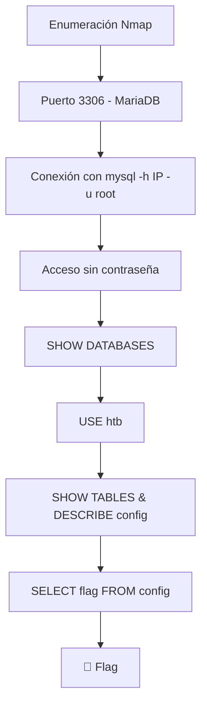

> [!info] Información de la máquina **Plataforma:** Hack The Box **Máquina:** Sequel **OS:** Linux **Dificultad:** Very Easy **IP objetivo:** 10.129.9.216 **Dominio:** `sequel.htb` **IP atacante:** `10.10.14.86`

---

## 1. Resumen

**Sequel** es una máquina Linux de dificultad Very Easy perteneciente al inicio de Hack The Box. Su objetivo es comprender el funcionamiento de bases de datos **MySQL / MariaDB**, la conexión remota mediante el cliente de línea de comandos `mysql`, y la exploración de bases de datos, tablas y columnas para extraer información sensible (en este caso, la **flag**).



> [!important] Idea clave
> La instancia MariaDB en el puerto 3306 permite el inicio de sesión remoto con el usuario `root` sin requerir ninguna contraseña, exponiendo la base de datos de la aplicación (`htb`) y la tabla `config` donde se almacena la flag.

---

## 2. Enumeración inicial

### 2.1 Resolución de nombres (/etc/hosts)

Empezamos agregando la dirección IP a nuestro `/etc/hosts`:


### 2.2 Comprobar conectividad

Comprobamos conectividad con el comando `ping`:


### 2.3 Escaneo de puertos con Nmap

Realizamos el escaneo de puertos:

```bash
sudo nmap -sCV --min-rate 5000 10.129.9.216 -oN SequelScan
```

| Flag | Propósito |
|---|---|
| `sudo` | Ejecuta Nmap con privilegios elevados |
| `-sC` | Ejecuta los scripts NSE predeterminados |
| `-sV` | Intenta identificar las versiones de los servicios |
| `--min-rate 5000` | Envía al menos 5000 paquetes por segundo (escaneo rápido) |
| `-oN SequelScan` | Guarda la salida en formato normal en `SequelScan` |


> **Resultado del escaneo:** El puerto **3306/tcp** se encuentra abierto corriendo MariaDB.

---

## 3. Explotación y Reconocimiento MySQL

### 3.1 Instalación y Conexión al cliente MySQL

Instalamos el cliente `mysql` (o `mariadb-client`) para poder comunicarnos con la base de datos objetivo:


Para especificar el usuario al iniciar sesión en la línea de comandos de MySQL usamos el switch `-u`:

```bash
mysql -h 10.129.9.216 -u root
```

Intentamos conectar con el usuario `root` sin proporcionar contraseña.


> [!success] Acceso concedido
> Nos conectamos exitosamente a la instancia MariaDB como `root` sin contraseña.

---

## 4. Exploración de Bases de Datos y Captura de Flag

### 4.1 Listar Bases de Datos

Al ejecutar `SHOW DATABASES;`, observamos las bases de datos comunes (`information_schema`, `mysql`, `performance_schema`) y una cuarta base de datos única propia del objetivo: **`htb`**.


### 4.2 Seleccionar la base de datos `htb`

Para seleccionar y trabajar sobre la base de datos `htb`, usamos el comando `USE`:

```sql
USE htb;
```


### 4.3 Consultar Tablas y Columnas

Listamos las tablas con `SHOW TABLES;` y describimos las columnas de la tabla `config` mediante el comando `DESCRIBE`:

```sql
DESCRIBE config;
```


Confirmamos que la tabla `config` contiene una columna llamada `name` y otra `value` (o la columna `flag`).

### 4.4 Extraer la Flag

Para consultar todo el contenido de la tabla `config` usamos el carácter comodín `*` en SQL finalizando la instrucción con `;`:

```sql
SELECT * FROM config;
```


> [!success] Flag obtenida
> La flag se encuentra almacenada dentro de la tabla `config`. ✅

---

## 5. Preguntas del módulo — Respuestas

| Pregunta | Respuesta |
|---|---|
| During our scan, which port do we find serving MySQL? | **3306** |
| What community-developed MySQL version is the target running? | **MariaDB** |
| When using the MySQL command line client, what switch do we need to use in order to specify a login username? | **`-u`** |
| Which username allows us to log into this MariaDB instance without providing a password? | **root** |
| In SQL, what symbol can we use to specify within the query that we want to display everything inside a table? | **`*`** |
| In SQL, what symbol do we need to end each query with? | **`;`** |
| There are three databases in this MySQL instance that are common across all MySQL instances. What is the name of the fourth that's unique to this host? | **htb** |
| What is the command in MySQL to select a database to interact with? | **`use`** |
| What is the command in MySQL to show the different columns for a given table? | **`describe`** |
| Which table has a column named "flag"? | **config** |

---

## 6. Cadena completa de ataque

```text
Escaneo de puertos (Nmap -p 3306)
        ↓
Puerto 3306 - MariaDB expuesto
        ↓
Conexión mediante cliente mysql (mysql -h IP -u root)
        ↓
Autenticación sin contraseña como root
        ↓
Enumeración de BD: SHOW DATABASES; -> htb
        ↓
Selección de BD: USE htb;
        ↓
Enumeración de tablas/columnas: SHOW TABLES; / DESCRIBE config;
        ↓
Consulta SQL: SELECT * FROM config;
        ↓
🏁 Flag
```

---

## 7. Conceptos aprendidos

- **MariaDB / MySQL en puerto 3306:** Identificación del servicio de base de datos relacional estándar.
- **Autenticación nula/vacía en MySQL:** Riesgo de mantener la cuenta `root` accesible sin contraseña a través de la red local o pública.
- **Comandos básicos SQL:** `SHOW DATABASES;`, `USE <db>;`, `SHOW TABLES;`, `DESCRIBE <table>;`, `SELECT * FROM <table>;`.

---

## 8. Remediación

- **Establecer contraseñas seguras:** Asignar una contraseña fuerte para el usuario `root` y todos los usuarios de la base de datos (`ALTER USER 'root'@'%' IDENTIFIED BY 'contraseña_segura';`).
- **Restringir acceso remoto:** Configurar `bind-address = 127.0.0.1` en `my.cnf` para que MySQL solo escuche localmente.
- **Principio de mínimo privilegio:** No permitir que servicios o usuarios externos se conecten como `root`.

---

## 9. Resumen final

```text
1. Verificar conectividad y realizar escaneo Nmap (puerto 3306 abierto)
2. Conectar a MariaDB usando: mysql -h 10.129.9.216 -u root
3. Listar bases de datos (SHOW DATABASES;) -> seleccionar 'htb' (USE htb;)
4. Inspeccionar la tabla 'config' (DESCRIBE config;)
5. Extraer la flag con: SELECT * FROM config;
```

> [!success] Resultado
> **Flag:** capturada ✅  
> **Vector:** Acceso MySQL desprotegido (`root` sin contraseña en puerto 3306)  
> **Servicio crítico:** MariaDB 

---
